# ELEX Edge AI Agent Swarm - Complete Architecture

**Version:** 2.1.0 | **Status:** Architecture Finalized | **Platform:** @ruvector/edge
**Integration:** Claude Flow V3 Deep Integration | **Date:** 2026-01-10

---

## Table of Contents

1. [Executive Summary](#executive-summary)
2. [ELEX System Architecture](#elex-system-architecture)
3. [Claude Flow V3 Integration](#claude-flow-v3-integration)
4. [Component Architecture](#component-architecture)
5. [Data Flow](#data-flow)
6. [Memory Architecture](#memory-architecture)
7. [Swarm Coordination](#swarm-coordination)
8. [Learning Pipeline](#learning-pipeline)
9. [Security Architecture](#security-architecture)
10. [Deployment](#deployment)
11. [Performance](#performance)
12. [API Reference](#api-reference)
13. [Appendices](#appendices)

---

## Executive Summary

ELEX is an edge-first distributed AI system deploying **593 specialized self-learning agents** for autonomous Ericsson RAN optimization. The architecture achieves zero cloud infrastructure costs through P2P coordination while maintaining enterprise-grade reliability via hybrid consensus protocols.

### Key Architectural Metrics

| Metric | Value |
|--------|-------|
| Feature Agents | 593 specialized experts |
| Parameters Covered | 5,230 across 452 features |
| Counters Covered | 5,416 across 344 features |
| KPIs Tracked | 736 across 156 features |
| Infrastructure Cost | $0-50/month (vs. $2,600 cloud) |
| Task Routing Latency | <1ms semantic matching |
| Root Cause Accuracy | >85% |

### Integration Goals

| Goal | ELEX Contribution | Claude Flow V3 Contribution |
|------|-------------------|---------------------------|
| Unified Memory | HNSW index, Q-tables, trajectories | AgentDB vectors, memory store, trajectories table |
| Distributed Learning | Q-Learning, federated merge | SONA, ReasoningBank, pattern learning |
| Swarm Coordination | Raft consensus, Gossip sync | Hive-mind, hierarchical-mesh topology |
| Performance | SIMD ops (3-8x speedup), <1ms routing | Flash Attention (2.49-7.47x), 150x-12,500x search |

---

## ELEX System Architecture

### System Layers Diagram

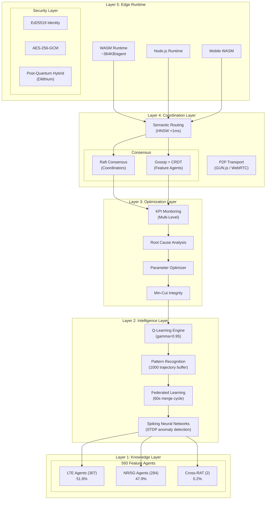

### Agent Distribution by Category

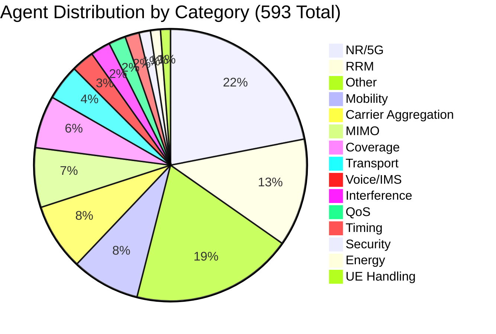

---

## Claude Flow V3 Integration

### Unified Layer Diagram

```
+====================================================================================+
|                           UNIFIED ORCHESTRATION LAYER                               |
|  +------------------------------------------------------------------------------+  |
|  |                      Claude Flow V3 Swarm Coordinator                        |  |
|  |  - Hierarchical-mesh topology                                                 |  |
|  |  - 60+ agent types + 593 ELEX feature agents                                 |  |
|  |  - Hive-mind consensus (Byzantine + Raft + Gossip)                           |  |
|  +------------------------------------------------------------------------------+  |
+====================================================================================+
         |                              |                              |
         v                              v                              v
+------------------+       +------------------+       +------------------+
|   RUNTIME BRIDGE |       |  MEMORY BRIDGE   |       | LEARNING BRIDGE  |
|   (WASM Loader)  |       | (AgentDB+HNSW)   |       | (Q+ReasoningBank)|
+------------------+       +------------------+       +------------------+
         |                              |                              |
         v                              v                              v
+====================================================================================+
|                              ELEX WASM RUNTIME                                      |
|  +------------------------------------------------------------------------------+  |
|  |                      593 Feature Agents (Rust/WASM)                          |  |
|  |  - LTE Agents (307) | NR/5G Agents (284) | Cross-RAT (2)                    |  |
|  |  - SIMD-accelerated ops | Q-Learning | Federated sync                        |  |
|  +------------------------------------------------------------------------------+  |
+====================================================================================+
         |                              |                              |
         v                              v                              v
+------------------+       +------------------+       +------------------+
|   SIMD Engine    |       |   Q-Learning     |       |   P2P Coord      |
| (cosine, batch)  |       |   (gamma=0.95)   |       |  (Raft/Gossip)   |
+------------------+       +------------------+       +------------------+
```

### Component Interaction Flow

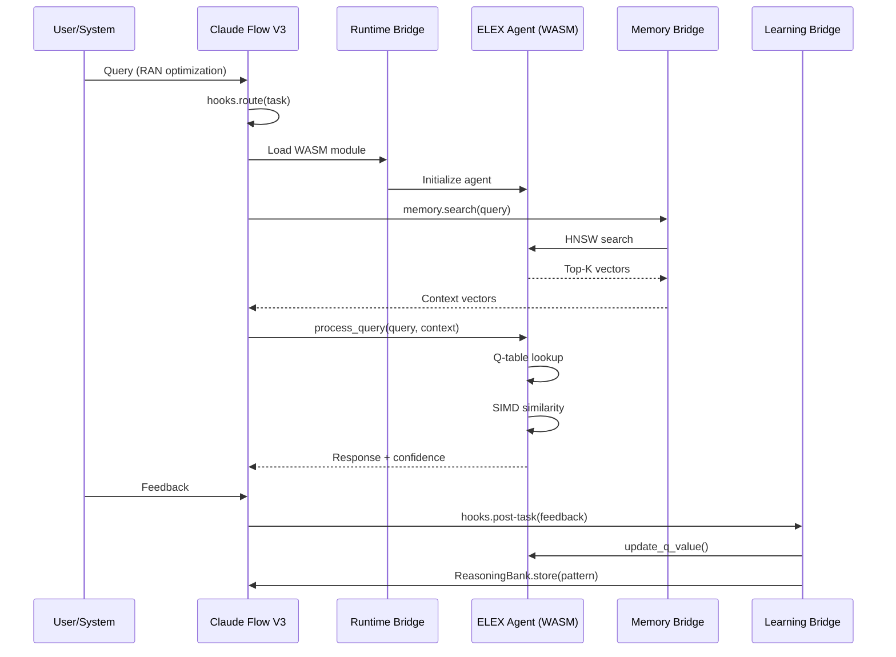

---

## Component Architecture

### Feature Agent Architecture

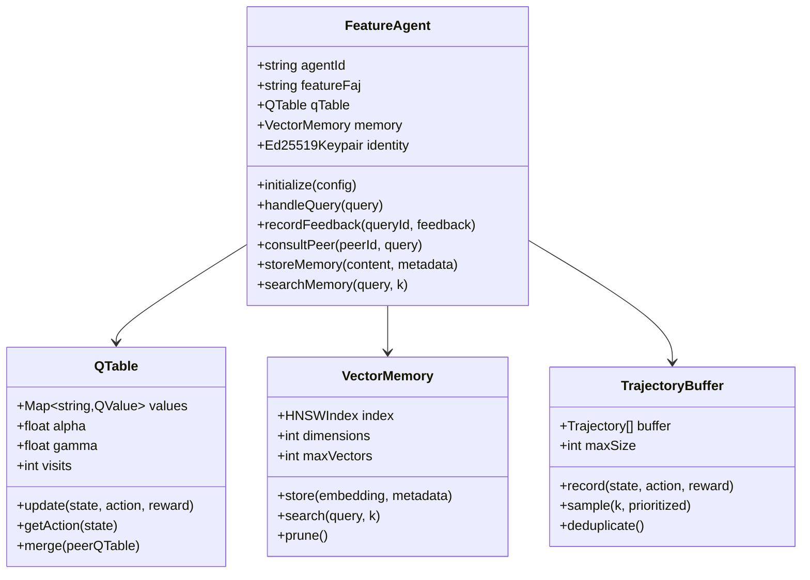

### WASM Module Loading

```typescript
interface WASMModuleConfig {
  moduleUrl: string;
  memoryPages: number;  // 64KB each
  features: string[];   // ['simd128', 'bulk-memory']
  preloadAgents?: string[];
}

interface ElexAgentHandle {
  id: string;
  wasmInstance: WebAssembly.Instance;
  memory: WebAssembly.Memory;
  exports: ElexWASMExports;
}

interface ElexWASMExports {
  // Agent lifecycle
  create_agent(config: Uint8Array): number;
  destroy_agent(handle: number): void;

  // Query processing
  process_query(handle: number, query: Uint8Array): Uint8Array;
  validate_parameters(handle: number, params: Uint8Array): Uint8Array;

  // Learning
  update_learning(handle: number, feedback: Uint8Array): void;
  get_q_value(handle: number, state: Uint8Array, action: number): number;

  // Memory
  memory_search(handle: number, query: Uint8Array, k: number): Uint8Array;
  memory_store(handle: number, key: Uint8Array, value: Uint8Array): void;

  // SIMD batch ops
  batch_similarity(query: Uint8Array, candidates: Uint8Array, k: number): Uint8Array;
  batch_q_update(q_values: Uint8Array, rewards: Uint8Array, next_max: Uint8Array): void;
}
```

---

## Data Flow

### Query Processing Flow

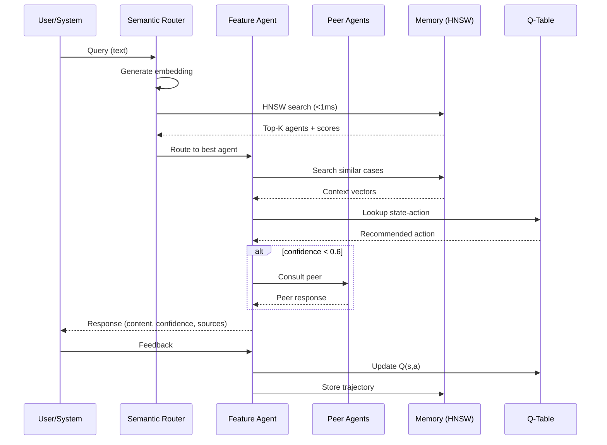

### Closed-Loop Optimization Flow

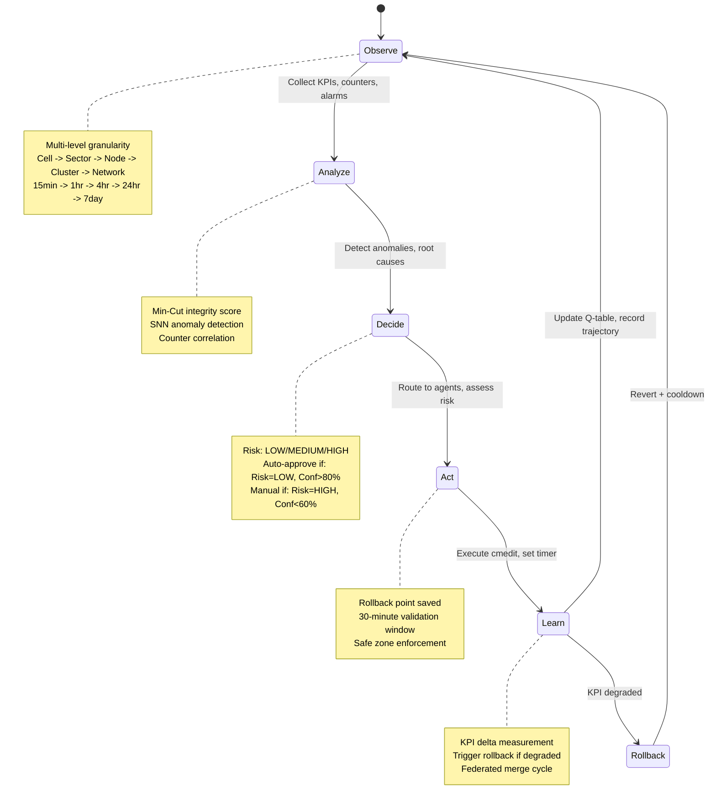

---

## Memory Architecture

### 4-Layer Memory System

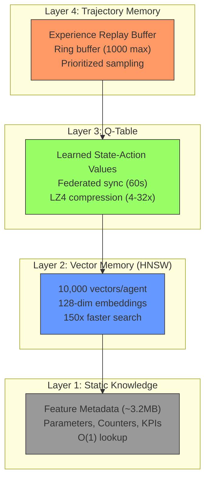

### Unified Memory Schema

```sql
-- Claude Flow AgentDB schema extended for ELEX integration

-- Vectors table (HNSW-indexed for both systems)
CREATE TABLE IF NOT EXISTS vectors (
  id TEXT PRIMARY KEY,
  agent_id TEXT NOT NULL,
  source TEXT NOT NULL,  -- 'claude-flow' | 'elex'
  embedding BLOB NOT NULL,  -- 128-dim float32 (512 bytes)
  metadata JSON,
  created_at INTEGER DEFAULT (strftime('%s', 'now')),
  updated_at INTEGER DEFAULT (strftime('%s', 'now')),

  -- ELEX-specific fields
  faj_code TEXT,
  category TEXT,
  feature_type TEXT,  -- 'LTE' | 'NR' | 'Cross-RAT'

  FOREIGN KEY (agent_id) REFERENCES agents(id)
);

-- Q-Table persistence (ELEX Q-learning state)
CREATE TABLE IF NOT EXISTS q_tables (
  id INTEGER PRIMARY KEY AUTOINCREMENT,
  agent_id TEXT NOT NULL,
  state_hash TEXT NOT NULL,
  action INTEGER NOT NULL,
  q_value REAL NOT NULL,
  visit_count INTEGER DEFAULT 1,
  confidence REAL,
  last_updated INTEGER DEFAULT (strftime('%s', 'now')),

  UNIQUE(agent_id, state_hash, action),
  FOREIGN KEY (agent_id) REFERENCES agents(id)
);

-- Unified trajectories table (both systems)
CREATE TABLE IF NOT EXISTS trajectories (
  id INTEGER PRIMARY KEY AUTOINCREMENT,
  session_id TEXT NOT NULL,
  agent_id TEXT NOT NULL,
  source TEXT NOT NULL,  -- 'claude-flow' | 'elex'

  -- Common fields
  state_embedding BLOB,
  action TEXT NOT NULL,
  reward REAL,
  next_state_embedding BLOB,

  -- ELEX-specific
  elex_state_hash TEXT,
  elex_action_id INTEGER,
  kpi_delta JSON,

  -- Claude Flow specific
  hook_event TEXT,
  pattern_id TEXT,

  timestamp INTEGER DEFAULT (strftime('%s', 'now')),
  metadata JSON,

  FOREIGN KEY (session_id) REFERENCES sessions(id),
  FOREIGN KEY (agent_id) REFERENCES agents(id)
);

-- HNSW index configuration
CREATE TABLE IF NOT EXISTS hnsw_config (
  table_name TEXT PRIMARY KEY,
  dimension INTEGER NOT NULL,
  m INTEGER DEFAULT 16,
  ef_construction INTEGER DEFAULT 200,
  ef_search INTEGER DEFAULT 50,
  distance_metric TEXT DEFAULT 'cosine'
);

INSERT OR REPLACE INTO hnsw_config VALUES
  ('vectors', 128, 16, 200, 50, 'cosine');
```

---

## Swarm Coordination

### Consensus Protocol Selection

| Scenario | Protocol | Rationale |
|----------|----------|-----------|
| Coordinator cluster | Raft | Strong consistency for task routing |
| Feature agent sync | Gossip + CRDT | Eventually consistent, partition tolerant |
| Vector index updates | Raft-based | Prevents split-brain in routing |
| Q-table federation | Gossip | High availability over strict consistency |

### Consensus Protocol Mapping

```
+====================================================================================+
|                        UNIFIED CONSENSUS LAYER                                      |
+====================================================================================+
|                                                                                     |
|  Claude Flow Hive-Mind                    ELEX Coordination                         |
|  +---------------------------+            +---------------------------+             |
|  | Byzantine Coordinator     |<---------->| Raft Coordinator Cluster  |             |
|  | (f < n/3 fault tolerant)  |   bridge   | (strong consistency)      |             |
|  +---------------------------+            +---------------------------+             |
|             |                                          |                            |
|             v                                          v                            |
|  +---------------------------+            +---------------------------+             |
|  | Gossip Coordinator        |<---------->| Gossip + CRDT Sync        |             |
|  | (eventual consistency)    |   merge    | (feature agents)          |             |
|  +---------------------------+            +---------------------------+             |
|             |                                          |                            |
|             v                                          v                            |
|  +---------------------------+            +---------------------------+             |
|  | CRDT Synchronizer         |<---------->| Federated Learning Merge  |             |
|  | (conflict-free)           |  unified   | (60s cycle)               |             |
|  +---------------------------+            +---------------------------+             |
|                                                                                     |
+====================================================================================+

Protocol Selection Matrix:
+-----------------------+------------------+------------------+
| Operation             | Claude Flow      | ELEX             |
+-----------------------+------------------+------------------+
| Task routing          | Raft             | Raft             |
| Agent state sync      | Gossip           | Gossip + CRDT    |
| Q-table federation    | CRDT             | Gossip           |
| Vector index updates  | Raft             | Raft-based       |
| Pattern learning      | Gossip           | Federated        |
+-----------------------+------------------+------------------+
```

---

## Learning Pipeline

### Unified Learning Architecture

```
+====================================================================================+
|                         UNIFIED LEARNING PIPELINE                                   |
+====================================================================================+
|                                                                                     |
|  +--------------------------+        +--------------------------+                   |
|  |    ELEX Q-Learning       |        | Claude Flow SONA         |                   |
|  |--------------------------|        |--------------------------|                   |
|  | Q(s,a) = Q(s,a) + alpha  |        | Self-Optimizing Neural   |                   |
|  |   * (r + gamma*max(Q')   |        | Architecture (<0.05ms)   |                   |
|  |   - Q(s,a))              |        |                          |                   |
|  +--------------------------+        +--------------------------+                   |
|             |                                    |                                  |
|             v                                    v                                  |
|  +--------------------------+        +--------------------------+                   |
|  |    Trajectory Buffer     |------->|    ReasoningBank         |                   |
|  |  (ELEX ring buffer)      | merge  |  (vector patterns)       |                   |
|  +--------------------------+        +--------------------------+                   |
|             |                                    |                                  |
|             v                                    v                                  |
|  +--------------------------+        +--------------------------+                   |
|  |  Federated Q-Merge       |<------>|  EWC++ Consolidation     |                   |
|  |  (60s cycle)             | sync   |  (prevent forgetting)    |                   |
|  +--------------------------+        +--------------------------+                   |
|             |                                    |                                  |
|             +----------------+------------------+                                   |
|                              |                                                      |
|                              v                                                      |
|                   +------------------------+                                        |
|                   | Unified Pattern Store  |                                        |
|                   |  (AgentDB vectors)     |                                        |
|                   +------------------------+                                        |
|                                                                                     |
+====================================================================================+
```

### Intelligence Pipeline Flow

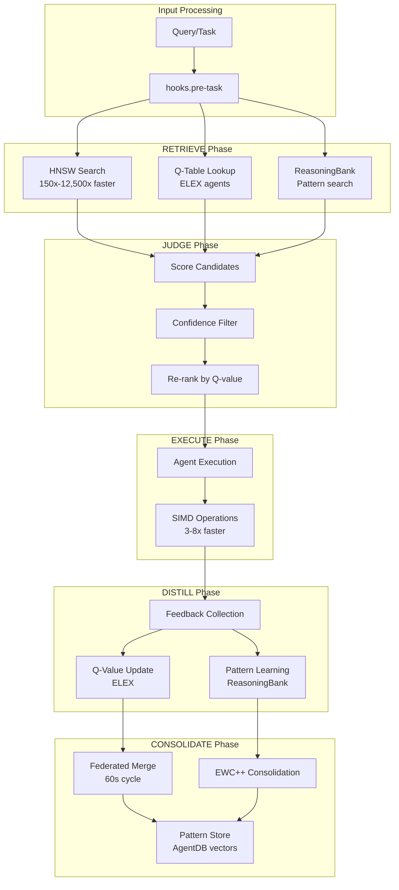

---

## Security Architecture

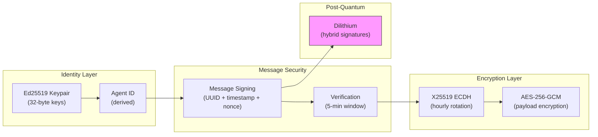

---

## Deployment

### Hybrid Deployment (Recommended)

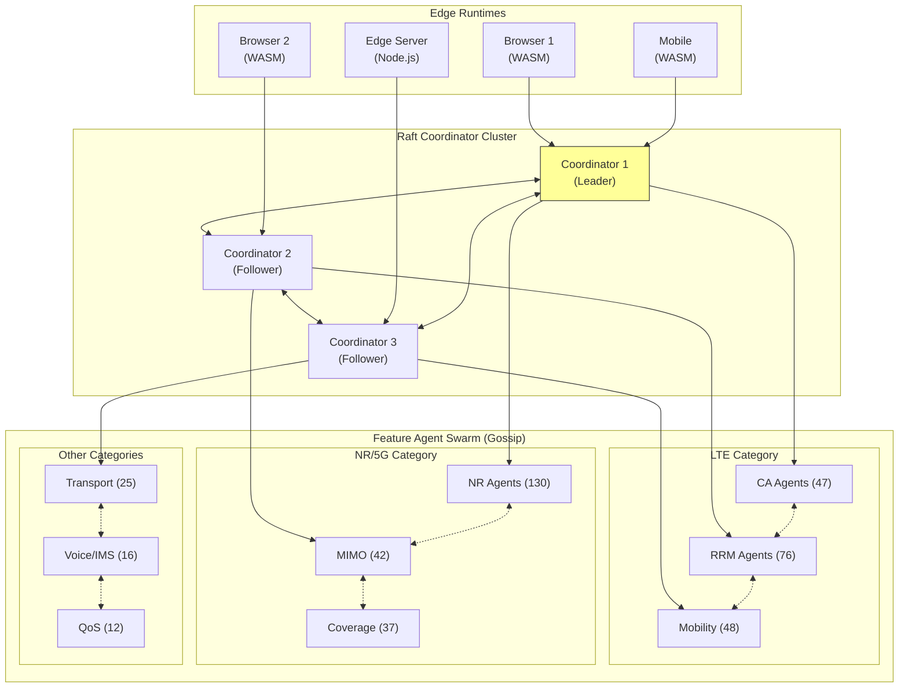

### Scaling Topology by Phase

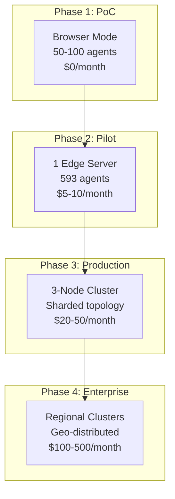

### Configuration File

```yaml
# claude-flow.config.yaml

version: "3.0"
name: "elex-integrated-deployment"

# Swarm configuration
swarm:
  topology: hierarchical-mesh
  maxAgents: 608  # 15 CF agents + 593 ELEX agents
  strategy: adaptive
  consensus:
    coordinators: raft
    agents: gossip

# ELEX integration
elex:
  enabled: true
  wasmModuleUrl: "./elex-wasm/pkg/elex_wasm.wasm"
  memoryPages: 256  # 16MB
  features:
    - simd128
    - bulk-memory
  preloadAgents:
    - "FAJ 121 3094"  # IFLB
    - "FAJ 121 3109"  # DUAC

# Memory configuration
memory:
  backend: hybrid
  agentDBPath: "./data/agentdb.sqlite"
  hnsw:
    dimension: 128
    m: 16
    efConstruction: 200
    efSearch: 50

# Hooks configuration
hooks:
  enabled: true
  workers:
    - elex-federated-sync
    - elex-qtable-persist
    - elex-trajectory-consolidate
    - elex-hnsw-optimize

# Learning configuration
learning:
  qLearning:
    alpha: 0.1
    gamma: 0.95
    epsilon: 0.1
  sona:
    adaptationRate: 0.00005  # <0.05ms
    moeExperts: 8
  syncInterval: 60000

# Performance targets
performance:
  queryTimeout: 500
  hookTimeout: 5
  wasmSpawnTimeout: 200
```

---

## Performance

### Unified Performance Matrix

| Operation | ELEX Target | Claude Flow Target | Integrated Target |
|-----------|-------------|-------------------|-------------------|
| Vector similarity (128-dim) | <100us (SIMD) | <50us (HNSW) | <50us |
| Q-table lookup | <1ms | N/A | <1ms |
| HNSW search (10K vectors) | <50ms | <5ms (indexed) | <5ms |
| Agent spawn (WASM) | <100ms | <200ms | <200ms |
| Query routing | <1ms | <10ms | <5ms |
| Federated merge cycle | <1s | N/A | <1s |
| Pattern learning | <10ms | <0.05ms (SONA) | <5ms |
| Memory consolidation | <100ms | <50ms (EWC++) | <50ms |
| Hook execution (per hook) | N/A | <5ms | <5ms |
| End-to-end query | <500ms | <100ms | <200ms |

### Memory Budget

| Component | ELEX Budget | Claude Flow Budget | Integrated Budget |
|-----------|-------------|-------------------|-------------------|
| WASM module (gzipped) | <500KB | N/A | <500KB |
| Per agent instance | <5KB | <10KB | <10KB |
| Q-table (1000 entries) | <50KB | N/A | <50KB |
| HNSW index (10K vectors) | <6MB | <10MB | <10MB |
| Trajectory buffer | <500KB | <1MB | <1MB |
| ReasoningBank patterns | N/A | <5MB | <5MB |
| Total runtime (10 agents) | <10MB | <50MB | <50MB |

### Latency Budget

```mermaid
gantt
    title Query Processing Latency Budget
    dateFormat X
    axisFormat %L ms

    section Routing
    HNSW Search     :0, 1
    Agent Selection :1, 2

    section Processing
    Context Retrieval :2, 50
    Q-Table Lookup    :50, 55
    Response Gen      :55, 450

    section Optional
    Peer Consultation :450, 500
```

---

## API Reference

### Runtime Bridge API

```typescript
interface RuntimeBridgeAPI {
  // Module management
  loadModule(url: string): Promise<WebAssembly.Module>;
  unloadModule(url: string): void;

  // Agent lifecycle
  spawnAgent(agentId: string, config: AgentConfig): Promise<ElexAgentHandle>;
  destroyAgent(agentId: string): void;
  getAgent(agentId: string): ElexAgentHandle | undefined;
  listAgents(): ElexAgentHandle[];

  // Query processing
  processQuery(agentId: string, query: Query): Promise<Response>;
  batchProcess(queries: BatchQuery[]): Promise<Response[]>;

  // Learning
  updateLearning(agentId: string, feedback: Feedback): Promise<void>;
  getQValue(agentId: string, state: string, action: number): number;

  // Memory
  memorySearch(agentId: string, query: Float32Array, k: number): Promise<SearchResult[]>;
  memoryStore(agentId: string, key: string, value: Uint8Array): Promise<void>;
}
```

### Memory Bridge API

```typescript
interface MemoryBridgeAPI {
  // Vector operations
  storeVector(agentId: string, embedding: Float32Array, metadata: VectorMetadata): Promise<string>;
  searchVectors(query: Float32Array, k: number, filters?: VectorFilters): Promise<SearchResult[]>;
  deleteVector(id: string): Promise<void>;

  // Q-Table operations
  persistQTable(agentId: string, qTable: QTable): Promise<void>;
  loadQTable(agentId: string): Promise<QTable>;
  mergeQTables(agentId: string, peerQTable: QTable): Promise<QTable>;

  // Trajectory operations
  recordTrajectory(trajectory: TrajectoryEntry): Promise<void>;
  sampleTrajectories(k: number, options?: SampleOptions): Promise<TrajectoryEntry[]>;

  // HNSW management
  optimizeHNSW(): Promise<void>;
  rebuildHNSW(): Promise<void>;
  getHNSWStats(): HNSWStats;
}
```

### Learning Bridge API

```typescript
interface LearningBridgeAPI {
  // Hook handlers
  onPreTask(context: HookContext): Promise<HookResult>;
  onPostTask(context: HookContext, result: TaskResult): Promise<HookResult>;

  // Q-Learning
  getQRecommendations(agents: string[], task: Task): Promise<QRecommendation[]>;
  updateElexQLearning(agentId: string, task: Task, result: TaskResult, reward: number): Promise<void>;

  // Pattern learning
  classifyQuery(task: Task): Promise<QueryClassification>;
  searchPatterns(query: string, options?: SearchOptions): Promise<Pattern[]>;
  storePattern(pattern: Pattern): Promise<string>;

  // Sync operations
  federatedMerge(): Promise<void>;
  syncWithReasoningBank(): Promise<void>;
}
```

### Swarm Bridge API

```typescript
interface SwarmBridgeAPI {
  // Swarm lifecycle
  initializeSwarm(task: Task): Promise<SwarmSession>;
  terminateSwarm(swarmId: string): Promise<void>;
  getSwarmStatus(swarmId: string): SwarmStatus;

  // Agent routing
  routeToElexAgents(task: Task): Promise<ElexFeature[]>;
  registerElexAgent(agent: ElexAgentHandle): Promise<void>;

  // Consensus
  proposeConsensus(proposal: ConsensusProposal): Promise<ConsensusResult>;
  getConsensusState(): ConsensusState;
}
```

---

## Appendices

### A. Component Mapping Table

| ELEX Component | Claude Flow V3 Component | Integration Point |
|----------------|-------------------------|-------------------|
| `elex-core` | `@claude-flow/core` | Type definitions, error handling |
| `elex-simd` | `@claude-flow/embeddings` | Vector operations, batch processing |
| `elex-qlearning` | `@claude-flow/hooks` (ReasoningBank) | Learning pipeline |
| `elex-memory` | `@claude-flow/memory` (AgentDB) | Persistence, HNSW index |
| `elex-agent` | `@claude-flow/agents` | Agent lifecycle, factory pattern |
| `elex-coordination` | `@claude-flow/swarm` | Consensus, P2P routing |
| `elex-security` | `@claude-flow/security` | Identity, encryption |
| `elex-wasm` | `RuntimeBridge` | WASM boundary, FFI |

### B. Error Code Mapping

| ELEX Error | Claude Flow Error | Integration Handling |
|------------|------------------|---------------------|
| `AGENT_NOT_FOUND` | `AgentNotFoundError` | Fallback to CF agent pool |
| `SIMD_ERROR` | `OperationError` | Scalar fallback |
| `Q_LOOKUP_ERROR` | `LearningError` | Use default action |
| `STORAGE_ERROR` | `MemoryError` | Retry with backoff |
| `HNSW_ERROR` | `SearchError` | Linear search fallback |
| `CONSENSUS_TIMEOUT` | `CoordinationError` | Leader re-election |

### C. Hooks Integration Mapping

| ELEX Operation | Claude Flow Hook | Direction | Data Flow |
|----------------|------------------|-----------|-----------|
| Query received | `pre-task` | ELEX -> CF | Query classification, pattern search |
| Agent selected | `pre-route` | CF -> ELEX | Agent ID, confidence score |
| Query processed | `post-task` | ELEX -> CF | Response, Q-update signal |
| Feedback received | `post-edit` | Both | Reward, trajectory record |
| Q-table updated | `pattern-learned` | ELEX -> CF | Q-delta, state-action pair |
| Federated merge | `pattern-consolidated` | Both | Merged Q-table, new patterns |
| SIMD batch op | N/A (internal) | ELEX | Performance metrics |
| HNSW search | `pre-memory-retrieve` | Both | Query embedding, k-value |
| Memory store | `post-memory-store` | Both | Vector ID, metadata |

### D. Spatio-Temporal Analysis Granularity

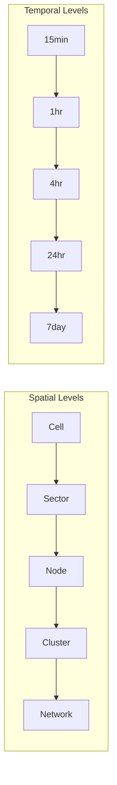

### E. Integration Points

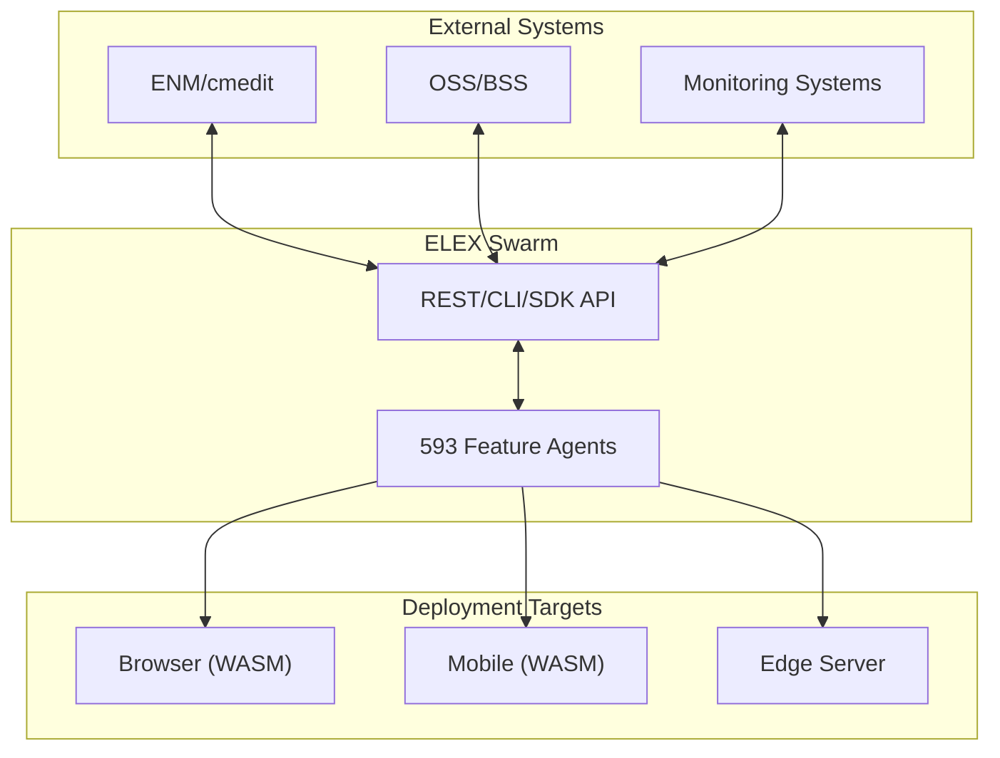

---

## References

- **ADR Index:** [docs/adr/README.md](./adr/README.md)
- **DDD Context Map:** [docs/ddd/README.md](./ddd/README.md)
- **Technical Decisions Matrix:** [docs/technical-decisions-matrix.md](./technical-decisions-matrix.md)
- **Full PRD:** [shortPRD.md](../shortPRD.md)
- **ELEX Rust Architecture:** [docs/rust-architecture.md](./rust-architecture.md)
- **Claude Flow V3 CLAUDE.md:** [claude-flow-v3/CLAUDE.md](../claude-flow-v3/CLAUDE.md)
- **Claude Flow V3 Hooks Types:** [claude-flow-v3/v3/@claude-flow/hooks/src/types.ts](../claude-flow-v3/v3/@claude-flow/hooks/src/types.ts)
- **AgentDB Documentation:** `@claude-flow/memory`
- **wasm-bindgen Guide:** https://rustwasm.github.io/wasm-bindgen/
