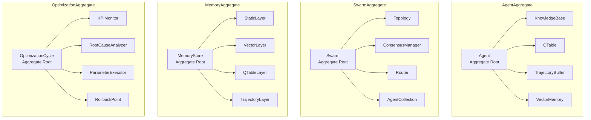
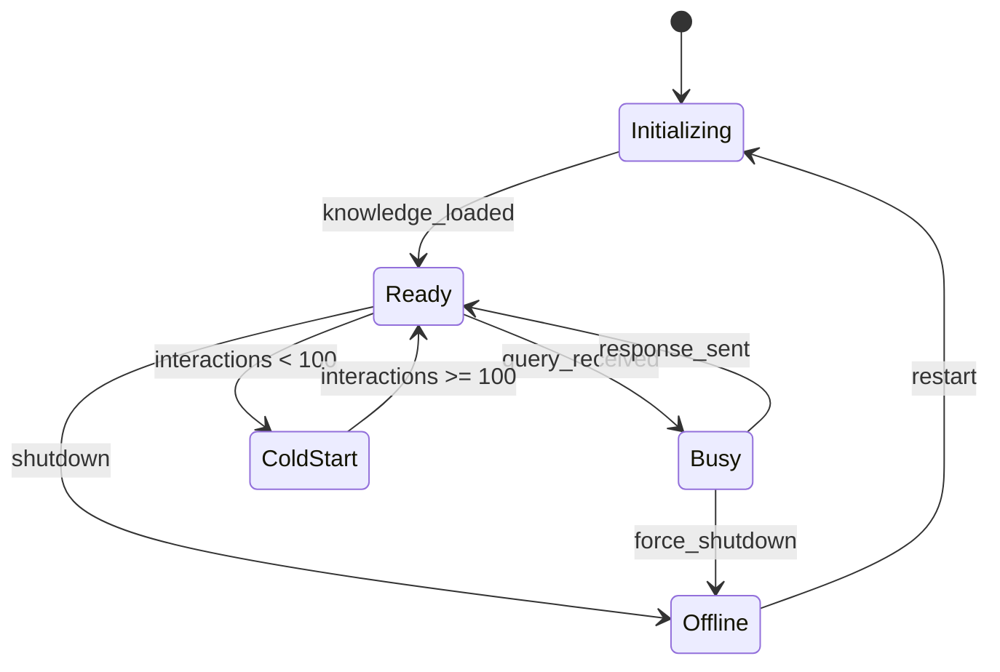
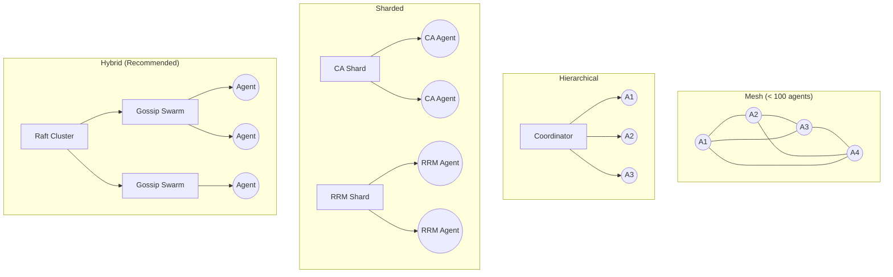
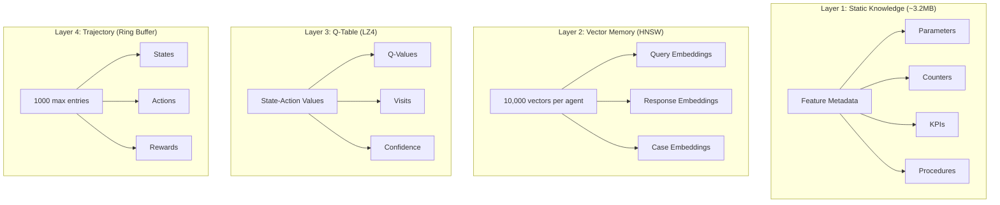
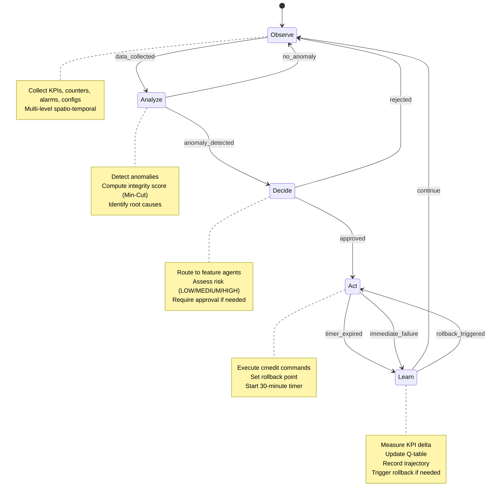
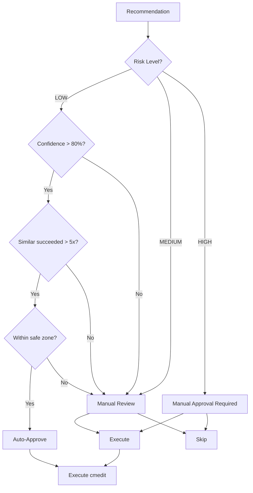
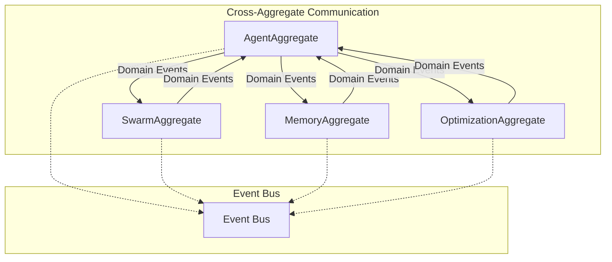

# ELEX Edge AI Agent Swarm - Aggregates

## Overview

Aggregates define transactional consistency boundaries in the ELEX domain. Each aggregate has a root entity that controls all access to entities within the boundary.



---

## 1. AgentAggregate

**Root Entity:** Agent

**Purpose:** Encapsulates a single feature agent's complete lifecycle, knowledge, and learning capabilities.

### Boundary

```typescript
class AgentAggregate {
  // Aggregate Root
  private readonly agent: Agent;

  // Entities within boundary
  private readonly knowledgeBase: KnowledgeBase;
  private readonly qTable: QTable;
  private readonly trajectoryBuffer: TrajectoryBuffer;
  private readonly vectorMemory: VectorMemory;

  // Factory method (only way to create)
  static create(config: AgentConfig): AgentAggregate {
    const agent = new Agent(
      AgentId.generate(),
      config.fajCode,
      config.type,
      config.category
    );
    return new AgentAggregate(
      agent,
      new KnowledgeBase(config.featureData),
      new QTable(config.qParams),
      new TrajectoryBuffer(1000),
      new VectorMemory(10000)
    );
  }
}
```

### Invariants

| Invariant | Description | Enforcement |
|-----------|-------------|-------------|
| One Agent Per FAJ | Each FAJ code has exactly one agent | Factory validation |
| Valid Status Transitions | Status follows defined state machine | State machine guard |
| Q-Table Consistency | Q-values updated atomically | Transaction boundary |
| Trajectory Limit | Buffer never exceeds 1000 entries | Ring buffer eviction |
| Memory Capacity | Vector memory capped at 10,000 entries | HNSW pruning |

### State Machine



### Commands

| Command | Description | Raises Event |
|---------|-------------|--------------|
| Initialize | Load knowledge base, initialize Q-table | AgentInitialized |
| HandleQuery | Process incoming query | QueryProcessed |
| RecordFeedback | Update Q-table with reward | FeedbackRecorded |
| ConsultPeer | Request expertise from another agent | PeerConsulted |
| StoreMemory | Add to HNSW vector index | MemoryStored |

### Example

```typescript
// Creating and using an AgentAggregate
const config: AgentConfig = {
  fajCode: new FAJCode('FAJ 121 3094'),
  type: AgentType.NR,
  category: Category.MIMO,
  featureData: mimoSleepModeData,
  qParams: { gamma: 0.95, alpha: 0.1, epsilon: 0.1 }
};

const agent = AgentAggregate.create(config);
await agent.initialize();

const response = await agent.handleQuery(query);
agent.recordFeedback(query.id, feedback);
```

---

## 2. SwarmAggregate

**Root Entity:** Swarm

**Purpose:** Manages the collective of agents, their topology, consensus, and routing.

### Boundary

```typescript
class SwarmAggregate {
  // Aggregate Root
  private readonly swarm: Swarm;

  // Entities within boundary
  private readonly topology: Topology;
  private readonly consensusManager: ConsensusManager;
  private readonly router: Router;
  private readonly agents: AgentCollection;

  // Factory method
  static create(config: SwarmConfig): SwarmAggregate {
    const swarm = new Swarm(
      SwarmId.generate(),
      config.topology,
      config.maxAgents
    );
    return new SwarmAggregate(
      swarm,
      Topology.create(config.topology),
      ConsensusManager.create(config.consensus),
      Router.create(config.routing),
      new AgentCollection()
    );
  }
}
```

### Invariants

| Invariant | Description | Enforcement |
|-----------|-------------|-------------|
| Max Agents | Never exceed configured maximum | Spawn validation |
| Unique Agents | No duplicate agent IDs | Collection constraint |
| Topology Consistency | All agents follow topology rules | Topology validator |
| Consensus Quorum | Raft requires 3+ coordinators | Startup validation |
| Router Index Sync | HNSW index always in sync | Event-driven update |

### Topology Rules



### Commands

| Command | Description | Raises Event |
|---------|-------------|--------------|
| Initialize | Set up topology and consensus | SwarmInitialized |
| SpawnAgent | Add new agent to swarm | AgentSpawned |
| TerminateAgent | Remove agent from swarm | AgentTerminated |
| RouteQuery | Find best agent for query | QueryRouted |
| ChangeTopology | Reconfigure swarm topology | TopologyChanged |
| ReachConsensus | Coordinate decision across agents | ConsensusReached |

### Example

```typescript
const swarmConfig: SwarmConfig = {
  topology: 'hybrid',
  maxAgents: 593,
  consensus: 'raft',
  routing: 'hnsw'
};

const swarm = SwarmAggregate.create(swarmConfig);
await swarm.initialize();

// Spawn all 593 feature agents
for (const feature of features) {
  await swarm.spawnAgent(AgentAggregate.create(feature));
}

// Route query to best agent
const response = await swarm.routeQuery(query);
```

---

## 3. MemoryAggregate

**Root Entity:** MemoryStore

**Purpose:** Manages the 4-layer memory system with persistence and synchronization.

### Boundary

```typescript
class MemoryAggregate {
  // Aggregate Root
  private readonly store: MemoryStore;

  // Layers within boundary
  private readonly staticLayer: StaticKnowledgeLayer;    // ~3.2MB
  private readonly vectorLayer: VectorMemoryLayer;       // HNSW
  private readonly qTableLayer: QTableLayer;             // LZ4 compressed
  private readonly trajectoryLayer: TrajectoryLayer;     // Ring buffer

  // Factory method
  static create(config: MemoryConfig): MemoryAggregate {
    return new MemoryAggregate(
      new MemoryStore(config.storageBackend),
      new StaticKnowledgeLayer(config.knowledgeData),
      new VectorMemoryLayer(config.hnswParams),
      new QTableLayer(config.compressionLevel),
      new TrajectoryLayer(config.bufferSize)
    );
  }
}
```

### 4-Layer Architecture



### Invariants

| Invariant | Description | Enforcement |
|-----------|-------------|-------------|
| Static Immutability | Layer 1 never modified at runtime | Readonly interface |
| Vector Capacity | Max 10,000 vectors per agent | HNSW eviction |
| Compression Ratio | Q-tables compressed 4-32x | LZ4 enforcement |
| Buffer Limit | Trajectories capped at 1000 | Ring buffer |
| Sync Frequency | Federated merge every 60s or 10 interactions | Timer + counter |

### Commands

| Command | Description | Raises Event |
|---------|-------------|--------------|
| Store | Add memory to appropriate layer | MemoryStored |
| Search | Vector similarity search | MemorySearched |
| UpdateQTable | Modify Q-values atomically | QTableUpdated |
| RecordTrajectory | Add to trajectory buffer | TrajectoryRecorded |
| FederatedMerge | Sync with peer memories | FederatedMergeCompleted |
| Compress | Reduce storage footprint | MemoryCompressed |

### Example

```typescript
const memoryConfig: MemoryConfig = {
  storageBackend: 'wasm-heap',
  knowledgeData: featureKnowledge,
  hnswParams: { dimensions: 128, maxElements: 10000 },
  compressionLevel: 'lz4-fast',
  bufferSize: 1000
};

const memory = MemoryAggregate.create(memoryConfig);

// Store and search
await memory.store(embedding, metadata);
const similar = await memory.search(queryEmbedding, { k: 5 });

// Federated merge
await memory.federatedMerge(peerMemory);
```

---

## 4. OptimizationAggregate

**Root Entity:** OptimizationCycle

**Purpose:** Manages the closed-loop optimization process from observation to learning.

### Boundary

```typescript
class OptimizationAggregate {
  // Aggregate Root
  private readonly cycle: OptimizationCycle;

  // Entities within boundary
  private readonly kpiMonitor: KPIMonitor;
  private readonly rootCauseAnalyzer: RootCauseAnalyzer;
  private readonly parameterExecutor: ParameterExecutor;
  private readonly rollbackPoint: RollbackPoint;
  private readonly timer: OptimizationTimer;

  // Factory method
  static create(config: OptimizationConfig): OptimizationAggregate {
    return new OptimizationAggregate(
      new OptimizationCycle(CycleId.generate()),
      new KPIMonitor(config.spatialLevel, config.temporalLevel),
      new RootCauseAnalyzer(config.counters),
      new ParameterExecutor(config.safeZones),
      new RollbackPoint(),
      new OptimizationTimer(30 * 60 * 1000) // 30 minutes
    );
  }
}
```

### 6-Phase Control Loop



### Invariants

| Invariant | Description | Enforcement |
|-----------|-------------|-------------|
| Safe Zone Enforcement | Parameters never exceed safe zones | Pre-execution validation |
| Rollback Required | Every change must have rollback point | Command pattern |
| Timer Active | 30-minute timer during Act phase | Timer guard |
| Approval Required | HIGH risk requires manual approval | Risk assessor |
| Blocked Conditions | No changes during CRITICAL_HW_FAILURE, etc. | Condition checker |
| Cooldown Period | Respect parameter cooldown windows | Cooldown tracker |

### Approval Logic



### Commands

| Command | Description | Raises Event |
|---------|-------------|--------------|
| StartCycle | Begin new optimization cycle | CycleStarted |
| Observe | Collect KPI and counter data | DataCollected |
| Analyze | Detect anomalies, find root causes | AnomalyDetected / RootCauseIdentified |
| Decide | Assess risk, request approval | ApprovalRequested / AutoApproved |
| Act | Execute parameter changes | ParameterChanged |
| Learn | Update Q-table, record outcome | OutcomeLearned |
| Rollback | Revert to rollback point | RollbackTriggered |

### Safe Zone Configuration Example

```typescript
const iflbSafeZone: SafeZoneConfig = {
  parameter: 'lbActivationThreshold',
  constraints: {
    min: 10,
    max: 100,
    safeMin: 50,
    safeMax: 90,
    changeLimit: 0.15,     // 15% max change
    cooldown: 60 * 60 * 1000  // 60 minutes
  },
  blockedConditions: [
    'CRITICAL_HW_FAILURE',
    'SITE_DOWN',
    { metric: 'callDropRate', operator: '>', value: 0.02 },
    { timeWindow: '00:00-06:00' }  // Night maintenance
  ]
};
```

### Example

```typescript
const optimizationConfig: OptimizationConfig = {
  spatialLevel: SpatialLevel.Node,
  temporalLevel: TemporalLevel.FourHour,
  counters: iflbCounters,
  safeZones: [iflbSafeZone]
};

const optimization = OptimizationAggregate.create(optimizationConfig);

// Run optimization cycle
const outcome = await optimization.run();

if (outcome.rollbackTriggered) {
  console.log('Rollback triggered:', outcome.reason);
} else {
  console.log('KPI improvement:', outcome.kpiDelta);
}
```

---

## Aggregate Relationships



## Consistency Model

| Aggregate | Consistency | Rationale |
|-----------|-------------|-----------|
| AgentAggregate | Strong | Agent state must be consistent |
| SwarmAggregate | Strong (Raft) / Eventual (Gossip) | Coordinators need strong, agents eventual |
| MemoryAggregate | Eventual | Performance over strict consistency |
| OptimizationAggregate | Strong | Safety-critical operations |
