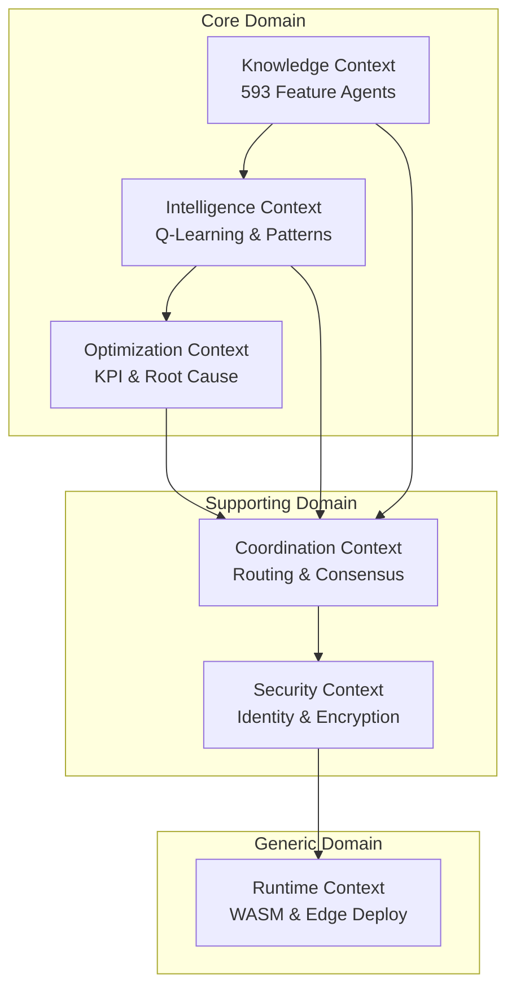
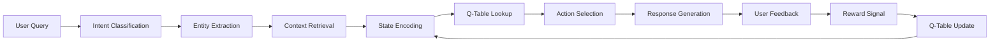
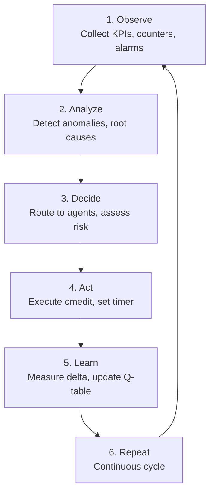
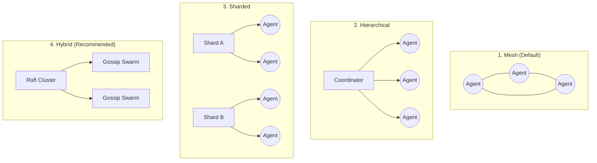
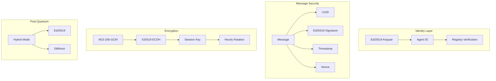
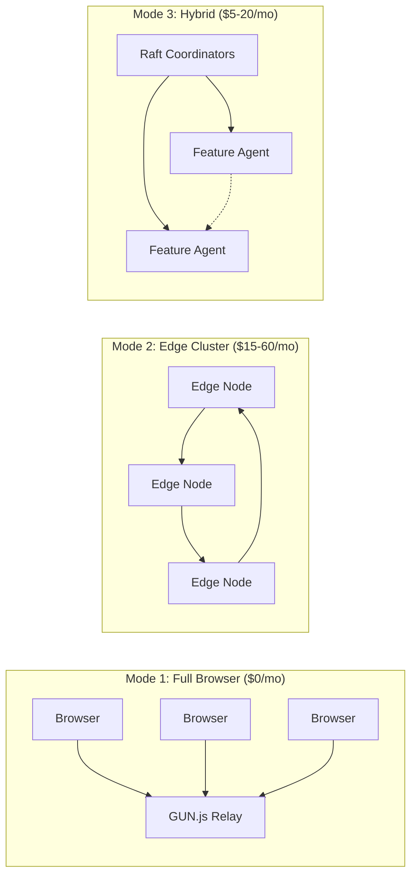

# ELEX Edge AI Agent Swarm - Bounded Contexts

## Overview

The ELEX system is decomposed into six bounded contexts, each representing a distinct area of domain expertise with clear boundaries and well-defined responsibilities.



---

## 1. Knowledge Context (Core Domain)

**Responsibility:** Managing the 593 specialized feature agents, each mastering a single Ericsson RAN feature.

### Scope

| Aspect | Details |
|--------|---------|
| Feature Agents | 593 specialized experts |
| LTE Features | 307 agents (51.8%) |
| NR/5G Features | 284 agents (47.9%) |
| Cross-RAT | 2 agents (0.2%) |
| Parameters | 5,230 across 452 features |
| Counters | 5,416 across 344 features |
| KPIs | 736 across 156 features |

### Ubiquitous Language

- **Feature**: A specific RAN capability identified by FAJ code
- **FAJ Code**: Ericsson Feature Activation Journal identifier
- **Parameter**: Configurable network setting
- **Counter**: Network measurement metric
- **KPI**: Key Performance Indicator derived from counters

### Key Aggregates

- `FeatureAgent` (Aggregate Root)
- `KnowledgeBase`
- `ParameterCatalog`
- `CounterCatalog`

### Categories

```
CA(47) | RRM(76) | MIMO(42) | Mobility(48) | NR(130) | Coverage(37)
Transport(25) | Voice(16) | Interference(14) | QoS(12) | Timing(10)
Security(8) | Energy(7) | UE(7) | Other(114)
```

---

## 2. Intelligence Context (Core Domain)

**Responsibility:** Self-learning capabilities including Q-learning, pattern recognition, trajectory replay, and federated learning.

### Scope

| Component | Details |
|-----------|---------|
| Q-Learning Engine | State-action value learning, gamma=0.95 |
| Trajectory Buffer | 1000 max entries, prioritized sampling |
| Federated Learning | Merge every 60s or 10 interactions |
| SNN Detection | STDP-based counter anomaly detection |

### Learning Architecture



### State-Action-Reward Framework

**States:**
- query_type
- complexity
- context_hash
- confidence

**Actions:**
- direct_answer
- context_answer
- consult_peer
- request_clarification
- escalate

**Rewards:**
- user_rating: [-1, +1]
- resolution_success: +0.5
- latency_penalty: variable
- consultation_cost: variable
- novelty_bonus: variable

### Key Aggregates

- `QTable` (Aggregate Root)
- `Trajectory`
- `FederatedMerger`
- `SpikingNeuralNetwork`

---

## 3. Optimization Context (Core Domain)

**Responsibility:** KPI monitoring, root cause analysis, parameter optimization, and system integrity assessment.

### Scope

| Component | Details |
|-----------|---------|
| KPI Monitoring | Multi-level spatio-temporal granularity |
| Root Cause Analysis | Counter investigation across time windows |
| Parameter Optimizer | Local optimization with safety validation |
| Min-Cut Integrity | Fragility detection via dependency analysis |

### 6-Phase Control Loop



### Spatio-Temporal Granularity

**Spatial Levels:**
```
Cell -> Sector -> Node -> Cluster -> Network
```

**Temporal Levels:**
```
15min -> 1hr -> 4hr -> 24hr -> 7day
```

### Key Aggregates

- `OptimizationCycle` (Aggregate Root)
- `KPIMonitor`
- `RootCauseAnalyzer`
- `SafeZone`
- `MinCutAnalyzer`

---

## 4. Coordination Context (Supporting Domain)

**Responsibility:** Semantic routing, consensus protocols, P2P transport, and swarm topology management.

### Scope

| Component | Details |
|-----------|---------|
| Semantic Routing | HNSW vector search (<1ms) |
| Raft Consensus | Strong consistency for coordinators |
| Gossip+CRDT | Eventual consistency for agents |
| P2P Transport | GUN.js or WebRTC |

### Topology Options



### Key Aggregates

- `Swarm` (Aggregate Root)
- `Router`
- `ConsensusManager`
- `TopologyManager`

---

## 5. Security Context (Supporting Domain)

**Responsibility:** Agent identity, message authentication, encryption, access control, and post-quantum security.

### Scope

| Component | Details |
|-----------|---------|
| Identity | Ed25519 keypairs (32-byte) |
| Encryption | AES-256-GCM for payloads |
| Key Exchange | X25519 ECDH (rotated hourly) |
| Post-Quantum | Ed25519 + Dilithium hybrid |

### Security Architecture



### Verification Rules

- 5-minute timestamp window
- Nonce deduplication
- Signature validation
- Sender confirmation against registry

### Key Aggregates

- `AgentIdentity` (Aggregate Root)
- `CryptoProvider`
- `AccessController`
- `MessageVerifier`

---

## 6. Runtime Context (Generic Domain)

**Responsibility:** WASM compilation, edge deployment, resource management, and cross-platform execution.

### Scope

| Platform | Details |
|----------|---------|
| Browser (WASM) | ~364KB binary per agent |
| Mobile (WASM) | Same agent binary |
| Edge Server | Node.js runtime |
| P2P | GUN.js public relays |

### Deployment Modes



### Key Aggregates

- `RuntimeEnvironment` (Aggregate Root)
- `WASMModule`
- `ResourceManager`
- `DeploymentConfiguration`

---

## Context Interactions Summary

| From Context | To Context | Integration Pattern |
|--------------|------------|---------------------|
| Knowledge | Intelligence | Partnership |
| Intelligence | Optimization | Customer-Supplier |
| Optimization | Coordination | Published Language |
| Coordination | Security | Conformist |
| Security | Runtime | Anti-Corruption Layer |
| Knowledge | Coordination | Open Host Service |

---

## Context Ownership

| Context | Team Responsibility | Core/Supporting/Generic |
|---------|---------------------|-------------------------|
| Knowledge | Domain Experts | Core |
| Intelligence | ML Engineers | Core |
| Optimization | Network Engineers | Core |
| Coordination | Platform Engineers | Supporting |
| Security | Security Engineers | Supporting |
| Runtime | Infrastructure | Generic |
