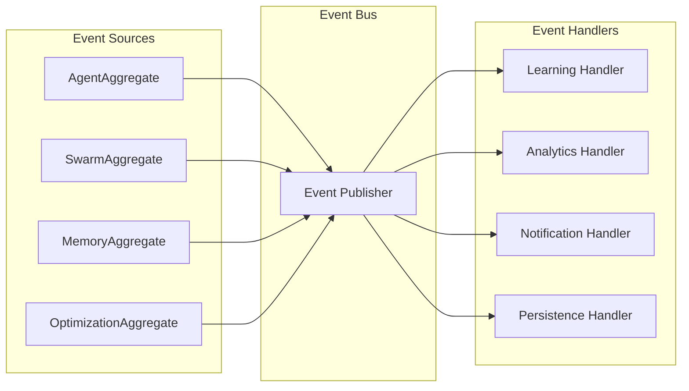
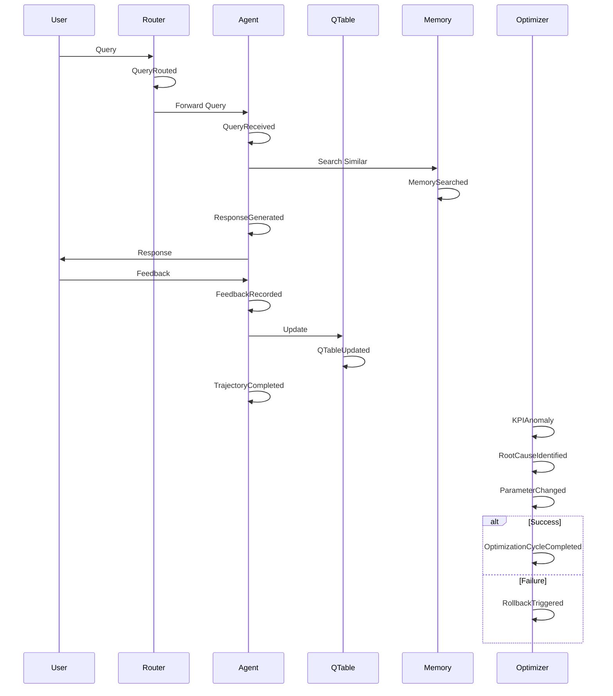

# ELEX Edge AI Agent Swarm - Domain Events

## Overview

Domain events represent significant occurrences within the ELEX system that other parts of the domain need to react to. Events are immutable facts about something that has happened.



---

## Event Categories

| Category | Description | Bounded Context |
|----------|-------------|-----------------|
| Query Events | User interactions | Knowledge |
| Learning Events | Q-learning updates | Intelligence |
| Optimization Events | Closed-loop operations | Optimization |
| Swarm Events | Coordination activities | Coordination |
| Security Events | Identity and access | Security |
| Memory Events | Storage operations | Supporting |

---

## Query Events

### QueryReceived

Fired when an agent receives a user query.

```typescript
interface QueryReceived {
  type: 'QueryReceived';
  timestamp: Date;

  // Identity
  queryId: QueryId;
  agentId: AgentId;

  // Payload
  queryType: QueryType;
  content: string;
  contextHash: Hash;
  complexity: ComplexityLevel;

  // Metadata
  sourceChannel: Channel;
  correlationId: CorrelationId;
}
```

**Raised by:** AgentAggregate
**Consumed by:** Analytics, Learning

---

### ResponseGenerated

Fired when an agent produces a response to a query.

```typescript
interface ResponseGenerated {
  type: 'ResponseGenerated';
  timestamp: Date;

  // Identity
  responseId: ResponseId;
  queryId: QueryId;
  agentId: AgentId;

  // Payload
  featureFaj: FAJCode;
  content: string;
  confidence: ConfidenceScore;

  // Context
  sources: Source[];
  cmeditCommands: CmeditCommand[];
  consultedAgents: AgentId[];
  latencyMs: number;

  // State
  actionTaken: Action;
  stateAtResponse: State;
}
```

**Raised by:** AgentAggregate
**Consumed by:** Learning, Analytics, Memory

---

### PeerConsulted

Fired when an agent consults another agent for expertise.

```typescript
interface PeerConsulted {
  type: 'PeerConsulted';
  timestamp: Date;

  // Identity
  sourceAgentId: AgentId;
  targetAgentId: AgentId;
  queryId: QueryId;

  // Payload
  consultationType: ConsultationType;
  question: string;

  // Outcome
  responseReceived: boolean;
  contributedToFinalAnswer: boolean;
  latencyMs: number;
}
```

**Raised by:** AgentAggregate
**Consumed by:** Swarm Analytics, Learning

---

## Learning Events

### FeedbackRecorded

Fired when user feedback is recorded for a response.

```typescript
interface FeedbackRecorded {
  type: 'FeedbackRecorded';
  timestamp: Date;

  // Identity
  feedbackId: FeedbackId;
  queryId: QueryId;
  responseId: ResponseId;
  agentId: AgentId;

  // Payload
  rating: number;           // [-1, +1]
  resolutionSuccess: boolean;
  feedbackText?: string;

  // Computed
  totalReward: Reward;

  // Context
  state: State;
  action: Action;
}
```

**Raised by:** AgentAggregate
**Consumed by:** Q-Table Updater, Trajectory Recorder

---

### QTableUpdated

Fired when Q-values are updated through learning.

```typescript
interface QTableUpdated {
  type: 'QTableUpdated';
  timestamp: Date;

  // Identity
  agentId: AgentId;
  stateActionKey: StateActionKey;

  // Values
  previousQValue: number;
  newQValue: number;
  delta: number;

  // Learning Parameters
  reward: Reward;
  learningRate: number;
  discountFactor: number;

  // Statistics
  visits: number;
  confidence: number;
}
```

**Raised by:** QTable
**Consumed by:** Federated Learner, Analytics

---

### TrajectoryCompleted

Fired when a complete trajectory is recorded.

```typescript
interface TrajectoryCompleted {
  type: 'TrajectoryCompleted';
  timestamp: Date;

  // Identity
  trajectoryId: TrajectoryId;
  agentId: AgentId;

  // Payload
  steps: number;
  cumulativeReward: number;
  startTime: Date;
  endTime: Date;

  // Context
  initialState: State;
  finalState: State;

  // Quality
  priorityScore: number;
  isDuplicate: boolean;
}
```

**Raised by:** TrajectoryBuffer
**Consumed by:** Experience Replay, Analytics

---

### FederatedMergeCompleted

Fired when Q-tables are merged with peer data.

```typescript
interface FederatedMergeCompleted {
  type: 'FederatedMergeCompleted';
  timestamp: Date;

  // Identity
  localAgentId: AgentId;
  peerAgentId: AgentId;

  // Statistics
  entriesMerged: number;
  conflictsResolved: number;

  // Method
  mergeStrategy: 'weighted_average' | 'max' | 'recent';

  // Outcome
  localEntriesUpdated: number;
  significantChanges: number;
}
```

**Raised by:** FederatedLearner
**Consumed by:** Analytics, Monitoring

---

## Optimization Events

### KPIAnomaly

Fired when a KPI anomaly is detected.

```typescript
interface KPIAnomaly {
  type: 'KPIAnomaly';
  timestamp: Date;

  // Identity
  anomalyId: AnomalyId;
  kpiName: string;

  // Location
  spatialLevel: SpatialLevel;
  spatialId: string;        // e.g., cell ID, node ID
  temporalLevel: TemporalLevel;

  // Values
  expectedValue: number;
  actualValue: number;
  deviation: number;
  threshold: Threshold;

  // Classification
  severity: Severity;
  anomalyType: AnomalyType;

  // Context
  relatedCounters: Counter[];
}
```

**Raised by:** KPIMonitor
**Consumed by:** Root Cause Analyzer, Alerting

---

### RootCauseIdentified

Fired when a root cause is identified for a KPI issue.

```typescript
interface RootCauseIdentified {
  type: 'RootCauseIdentified';
  timestamp: Date;

  // Identity
  rootCauseId: RootCauseId;
  anomalyId: AnomalyId;

  // Analysis
  kpi: KPI;
  correlatedCounters: Counter[];
  suspectedParameters: Parameter[];

  // Confidence
  confidence: number;         // Target: >85%
  evidenceStrength: number;

  // Recommendations
  recommendations: Recommendation[];

  // Context
  analysisWindow: TimeWindow;
  analysisMethod: AnalysisMethod;
}
```

**Raised by:** RootCauseAnalyzer
**Consumed by:** Optimization Cycle, Notification

---

### ParameterChanged

Fired when a network parameter is modified.

```typescript
interface ParameterChanged {
  type: 'ParameterChanged';
  timestamp: Date;

  // Identity
  changeId: ChangeId;
  cycleId: CycleId;
  agentId: AgentId;

  // Parameter
  parameterName: string;
  previousValue: ParameterValue;
  newValue: ParameterValue;
  targetMO: ManagedObject;

  // Command
  cmeditCommand: string;

  // Safety
  riskLevel: RiskLevel;
  approvalType: ApprovalType;
  approvedBy?: ApproverId;

  // Rollback
  rollbackPointId: RollbackPointId;
  rollbackCommand: string;
}
```

**Raised by:** ParameterExecutor
**Consumed by:** Learning, Audit Log, Monitoring

---

### RollbackTriggered

Fired when a parameter change is rolled back.

```typescript
interface RollbackTriggered {
  type: 'RollbackTriggered';
  timestamp: Date;

  // Identity
  rollbackId: RollbackId;
  changeId: ChangeId;
  cycleId: CycleId;

  // Reason
  triggerReason: RollbackReason;
  kpiDelta: number;
  threshold: number;

  // Execution
  rollbackCommand: string;
  executionTime: number;

  // Outcome
  success: boolean;
  verificationResult: VerificationResult;

  // Learning
  negativeReward: Reward;
}
```

**Raised by:** OptimizationCycle
**Consumed by:** Learning, Alerting, Audit Log

---

### OptimizationCycleCompleted

Fired when a full optimization cycle completes.

```typescript
interface OptimizationCycleCompleted {
  type: 'OptimizationCycleCompleted';
  timestamp: Date;

  // Identity
  cycleId: CycleId;
  agentIds: AgentId[];

  // Phases
  phases: PhaseResult[];

  // Outcome
  success: boolean;
  kpiImprovement: number;
  parametersChanged: number;
  rollbacksTriggered: number;

  // Timing
  startTime: Date;
  endTime: Date;
  totalDuration: number;

  // Learning
  trajectoriesRecorded: number;
  qTableUpdates: number;
}
```

**Raised by:** OptimizationAggregate
**Consumed by:** Analytics, Reporting

---

## Swarm Events

### SwarmInitialized

Fired when a swarm is initialized.

```typescript
interface SwarmInitialized {
  type: 'SwarmInitialized';
  timestamp: Date;

  // Identity
  swarmId: SwarmId;

  // Configuration
  topology: TopologyType;
  consensus: ConsensusType;
  maxAgents: number;

  // State
  initialAgentCount: number;
  coordinatorIds: AgentId[];
}
```

**Raised by:** SwarmAggregate
**Consumed by:** Monitoring, Logging

---

### AgentSpawned

Fired when a new agent joins the swarm.

```typescript
interface AgentSpawned {
  type: 'AgentSpawned';
  timestamp: Date;

  // Identity
  swarmId: SwarmId;
  agentId: AgentId;

  // Agent Details
  agentType: AgentType;
  fajCode: FAJCode;
  category: Category;

  // Registration
  publicKey: PublicKey;
  capabilities: Capability[];

  // Topology
  assignedShard?: ShardId;
  coordinatorId?: AgentId;
}
```

**Raised by:** SwarmAggregate
**Consumed by:** Router, Registry, Monitoring

---

### AgentTerminated

Fired when an agent leaves the swarm.

```typescript
interface AgentTerminated {
  type: 'AgentTerminated';
  timestamp: Date;

  // Identity
  swarmId: SwarmId;
  agentId: AgentId;

  // Reason
  reason: TerminationReason;
  graceful: boolean;

  // State Transfer
  stateTransferred: boolean;
  transferredTo?: AgentId;

  // Statistics
  uptime: number;
  queriesHandled: number;
  learningContributions: number;
}
```

**Raised by:** SwarmAggregate
**Consumed by:** Router, Registry, Analytics

---

### TopologyChanged

Fired when swarm topology is reconfigured.

```typescript
interface TopologyChanged {
  type: 'TopologyChanged';
  timestamp: Date;

  // Identity
  swarmId: SwarmId;

  // Change
  previousTopology: TopologyType;
  newTopology: TopologyType;

  // Impact
  affectedAgents: AgentId[];
  newCoordinators: AgentId[];
  removedCoordinators: AgentId[];

  // Reason
  changeReason: ChangeReason;
  triggeredBy: TriggeredBy;
}
```

**Raised by:** SwarmAggregate
**Consumed by:** All Agents, Monitoring

---

### ConsensusReached

Fired when swarm reaches consensus on a decision.

```typescript
interface ConsensusReached {
  type: 'ConsensusReached';
  timestamp: Date;

  // Identity
  consensusId: ConsensusId;
  swarmId: SwarmId;

  // Decision
  topic: ConsensusTopic;
  decision: Decision;

  // Voting
  participantCount: number;
  votesFor: number;
  votesAgainst: number;
  abstentions: number;

  // Protocol
  consensusProtocol: ConsensusProtocol;
  roundsRequired: number;

  // Timing
  proposalTime: Date;
  consensusTime: Date;
}
```

**Raised by:** ConsensusManager
**Consumed by:** Decision Executor, Audit Log

---

### QueryRouted

Fired when a query is routed to an agent.

```typescript
interface QueryRouted {
  type: 'QueryRouted';
  timestamp: Date;

  // Identity
  queryId: QueryId;
  swarmId: SwarmId;

  // Routing
  sourceAgentId?: AgentId;
  targetAgentId: AgentId;

  // Selection
  similarityScore: number;
  confidenceScore: number;
  candidatesConsidered: number;

  // Performance
  routingLatencyMs: number;
  hnswSearchTimeMs: number;
}
```

**Raised by:** Router
**Consumed by:** Analytics, Learning

---

## Security Events

### AgentAuthenticated

Fired when an agent successfully authenticates.

```typescript
interface AgentAuthenticated {
  type: 'AgentAuthenticated';
  timestamp: Date;

  // Identity
  agentId: AgentId;
  publicKey: PublicKey;

  // Verification
  verificationMethod: VerificationMethod;
  registryConfirmed: boolean;

  // Session
  sessionId: SessionId;
  sessionExpiry: Date;

  // Context
  sourceIp?: string;
  userAgent?: string;
}
```

**Raised by:** SecurityContext
**Consumed by:** Audit Log, Monitoring

---

### MessageVerified

Fired when an inter-agent message is verified.

```typescript
interface MessageVerified {
  type: 'MessageVerified';
  timestamp: Date;

  // Identity
  messageId: UUID;
  senderId: AgentId;
  recipientId: AgentId;

  // Verification
  signatureValid: boolean;
  timestampValid: boolean;
  nonceUnique: boolean;

  // Encryption
  encrypted: boolean;
  encryptionAlgorithm?: string;
}
```

**Raised by:** MessageVerifier
**Consumed by:** Audit Log

---

### SecurityViolation

Fired when a security violation is detected.

```typescript
interface SecurityViolation {
  type: 'SecurityViolation';
  timestamp: Date;

  // Identity
  violationId: ViolationId;
  suspectedAgentId?: AgentId;

  // Violation
  violationType: ViolationType;
  severity: Severity;
  description: string;

  // Evidence
  evidence: Evidence[];

  // Response
  actionTaken: SecurityAction;
  agentQuarantined: boolean;
}
```

**Raised by:** SecurityContext
**Consumed by:** Alerting, Incident Response

---

## Memory Events

### MemoryStored

Fired when content is stored in vector memory.

```typescript
interface MemoryStored {
  type: 'MemoryStored';
  timestamp: Date;

  // Identity
  memoryId: MemoryId;
  agentId: AgentId;

  // Content
  contentType: ContentType;
  contentHash: Hash;

  // Vector
  embedding: Vector;
  dimensions: number;

  // Index
  hnswNodeId: string;
  layer: MemoryLayer;
}
```

**Raised by:** MemoryAggregate
**Consumed by:** Analytics

---

### MemoryEvicted

Fired when memory is evicted due to capacity limits.

```typescript
interface MemoryEvicted {
  type: 'MemoryEvicted';
  timestamp: Date;

  // Identity
  memoryId: MemoryId;
  agentId: AgentId;

  // Reason
  evictionReason: EvictionReason;
  age: number;
  accessCount: number;

  // Capacity
  currentCapacity: number;
  maxCapacity: number;
}
```

**Raised by:** MemoryAggregate
**Consumed by:** Analytics, Monitoring

---

## Event Flow Diagram



---

## Event Storage and Replay

### Event Store Schema

```typescript
interface StoredEvent {
  eventId: UUID;
  aggregateId: string;
  aggregateType: string;
  eventType: string;
  version: number;
  timestamp: Date;
  payload: any;
  metadata: EventMetadata;
}

interface EventMetadata {
  correlationId: CorrelationId;
  causationId: CausationId;
  userId?: UserId;
  agentId?: AgentId;
}
```

### Retention Policy

| Event Category | Retention | Reason |
|----------------|-----------|--------|
| Query Events | 30 days | Rolling window for analytics |
| Learning Events | 90 days | Training data retention |
| Optimization Events | 1 year | Audit and compliance |
| Security Events | 2 years | Security audit requirements |
| Swarm Events | 30 days | Operational monitoring |
