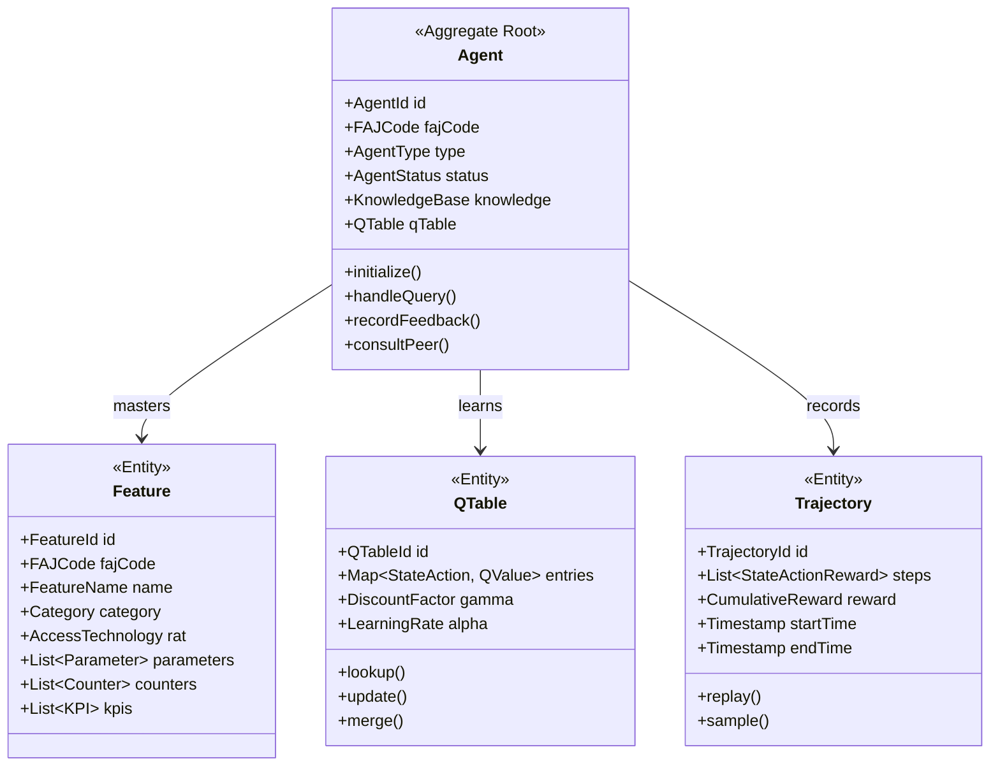
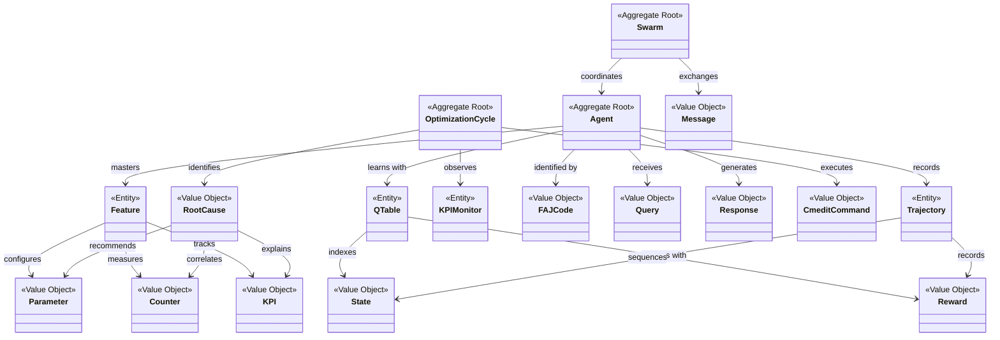

# ELEX Edge AI Agent Swarm - Domain Model

## Overview

This document defines the core domain entities, value objects, and their relationships within the ELEX system.



---

## Entities

### Agent (Aggregate Root)

The central entity representing a specialized feature agent.

```typescript
interface Agent {
  // Identity
  id: AgentId;                    // Derived from Ed25519 public key
  fajCode: FAJCode;               // FAJ code this agent masters
  type: AgentType;                // LTE | NR | CrossRAT
  category: Category;             // CA | RRM | MIMO | etc.

  // State
  status: AgentStatus;            // Initializing | Ready | Busy | Offline
  health: HealthScore;            // 0.0 - 1.0
  confidence: ConfidenceScore;    // 0.0 - 1.0

  // Knowledge
  knowledge: KnowledgeBase;       // Static feature knowledge
  qTable: QTable;                 // Learned state-action values
  trajectories: TrajectoryBuffer; // Experience replay buffer
  vectorMemory: VectorMemory;     // HNSW-indexed memories

  // Behavior
  initialize(config: AgentConfig): Promise<void>;
  handleQuery(query: Query): Promise<Response>;
  recordFeedback(queryId: QueryId, feedback: Feedback): void;
  consultPeer(peerId: AgentId, query: Query): Promise<Response>;
  storeMemory(content: string, metadata: Metadata): void;
  searchMemory(query: string, k: number): Promise<Memory[]>;
}
```

### Feature (Entity)

Represents a single Ericsson RAN feature.

```typescript
interface Feature {
  id: FeatureId;
  fajCode: FAJCode;               // e.g., "FAJ 121 3094"
  name: FeatureName;              // e.g., "MIMO Sleep Mode"
  description: string;
  category: Category;
  accessTechnology: AccessTechnology;

  // Configuration
  parameters: Parameter[];         // 5,230 total across system
  counters: Counter[];            // 5,416 total across system
  kpis: KPI[];                    // 736 total across system
  procedures: Procedure[];

  // Relationships
  dependencies: FeatureId[];
  conflicts: FeatureId[];
  relatedFeatures: FeatureId[];
}
```

### QTable (Entity)

Stores learned state-action values for Q-learning.

```typescript
interface QTable {
  id: QTableId;
  agentId: AgentId;

  // Q-Learning Parameters
  gamma: DiscountFactor;          // 0.95
  alpha: LearningRate;            // Adaptive
  epsilon: ExplorationRate;       // Decaying

  // State-Action Values
  entries: Map<StateActionKey, QEntry>;

  // Operations
  lookup(state: State, action: Action): QValue;
  update(state: State, action: Action, reward: Reward, nextState: State): void;
  merge(peerQTable: QTable): void;
  getConfidence(state: State, action: Action): ConfidenceScore;
}

interface QEntry {
  qValue: number;
  visits: number;
  confidence: number;
  outcomes: OutcomeHistory;
  lastUpdated: Timestamp;
}
```

### Trajectory (Entity)

Records a sequence of state-action-reward transitions for experience replay.

```typescript
interface Trajectory {
  id: TrajectoryId;
  agentId: AgentId;

  // Sequence
  steps: StateActionReward[];

  // Metrics
  cumulativeReward: number;
  length: number;
  startTime: Timestamp;
  endTime: Timestamp;

  // Operations
  replay(): Iterator<StateActionReward>;
  sample(priority: SamplingPriority): StateActionReward;
  isDuplicate(other: Trajectory): boolean;
}

interface StateActionReward {
  state: State;
  action: Action;
  reward: Reward;
  nextState: State;
}
```

### KPIMonitor (Entity)

Monitors KPIs at multiple spatio-temporal granularities.

```typescript
interface KPIMonitor {
  id: KPIMonitorId;

  // Scope
  spatialLevel: SpatialLevel;     // Cell | Sector | Node | Cluster | Network
  temporalLevel: TemporalLevel;   // 15min | 1hr | 4hr | 24hr | 7day

  // Observations
  observations: Observation[];
  anomalies: Anomaly[];
  trends: Trend[];

  // Operations
  observe(): Observation;
  detectAnomaly(threshold: Threshold): Anomaly[];
  analyzeTrend(window: TimeWindow): Trend;
  computeIntegrity(): IntegrityScore;
}
```

### OptimizationCycle (Entity)

Represents a single closed-loop optimization cycle.

```typescript
interface OptimizationCycle {
  id: CycleId;

  // Phases
  phase: OptimizationPhase;       // Observe | Analyze | Decide | Act | Learn | Repeat

  // Context
  targetKPI: KPI;
  rootCause: RootCause;
  recommendation: Recommendation;
  risk: RiskLevel;                // LOW | MEDIUM | HIGH

  // Execution
  rollbackPoint: RollbackPoint;
  timer: Timer;                   // 30 minutes
  outcome: CycleOutcome;

  // Operations
  execute(): Promise<CycleOutcome>;
  rollback(): Promise<void>;
  approve(approver: Approver): void;
}
```

---

## Value Objects

### FAJCode

Immutable identifier for an Ericsson feature.

```typescript
class FAJCode {
  constructor(private readonly value: string) {
    // Format: "FAJ XXX YYYY"
    if (!this.isValid(value)) {
      throw new InvalidFAJCodeError(value);
    }
  }

  private isValid(value: string): boolean {
    return /^FAJ \d{3} \d{4}$/.test(value);
  }

  equals(other: FAJCode): boolean {
    return this.value === other.value;
  }

  toString(): string {
    return this.value;
  }
}
```

### Query

Represents an incoming user query.

```typescript
class Query {
  constructor(
    readonly id: QueryId,
    readonly type: QueryType,        // parameter | counter | kpi | procedure | troubleshoot | general
    readonly content: string,
    readonly context: QueryContext,
    readonly timestamp: Timestamp
  ) {}

  readonly complexity: ComplexityLevel;
  readonly embedding: Vector;
}
```

### Response

The agent's response to a query.

```typescript
class Response {
  constructor(
    readonly queryId: QueryId,
    readonly agentId: AgentId,
    readonly featureFaj: FAJCode,
    readonly content: string,
    readonly confidence: ConfidenceScore,
    readonly sources: Source[],
    readonly cmeditCommands: CmeditCommand[],
    readonly relatedFeatures: FAJCode[],
    readonly consultedAgents: AgentId[],
    readonly latencyMs: number
  ) {}
}
```

### KPI

Key Performance Indicator value object.

```typescript
class KPI {
  constructor(
    readonly name: string,
    readonly value: number,
    readonly unit: Unit,
    readonly threshold: Threshold,
    readonly spatialScope: SpatialLevel,
    readonly temporalScope: TemporalLevel,
    readonly timestamp: Timestamp
  ) {}

  isAnomaly(): boolean {
    return this.value < this.threshold.min || this.value > this.threshold.max;
  }

  delta(previous: KPI): number {
    return this.value - previous.value;
  }
}
```

### Counter

Network measurement counter value object.

```typescript
class Counter {
  constructor(
    readonly name: string,
    readonly value: number,
    readonly featureId: FeatureId,
    readonly category: CounterCategory,  // Primary | Contributing | Contextual
    readonly timestamp: Timestamp
  ) {}

  deltaEncode(previous: Counter): number {
    return this.value - previous.value;
  }

  exceedsThreshold(threshold: number): boolean {
    return Math.abs(this.deltaEncode) > threshold;
  }
}
```

### Parameter

Configurable network parameter value object.

```typescript
class Parameter {
  constructor(
    readonly name: string,
    readonly value: ParameterValue,
    readonly dataType: DataType,
    readonly constraints: ParameterConstraints,
    readonly safeZone: SafeZone
  ) {}

  isWithinSafeZone(): boolean {
    return this.value >= this.safeZone.min &&
           this.value <= this.safeZone.max;
  }

  changeExceedsLimit(newValue: ParameterValue): boolean {
    const delta = Math.abs(newValue - this.value) / this.value;
    return delta > this.constraints.changeLimit;
  }
}

class SafeZone {
  constructor(
    readonly min: number,
    readonly max: number,
    readonly changeLimit: Percentage,  // e.g., 15%
    readonly cooldown: Duration        // e.g., 60min
  ) {}
}
```

### Reward

Reward signal for Q-learning.

```typescript
class Reward {
  constructor(
    readonly userRating: number,       // [-1, +1]
    readonly resolutionSuccess: number, // +0.5
    readonly latencyPenalty: number,
    readonly consultationCost: number,
    readonly noveltyBonus: number
  ) {}

  total(): number {
    return this.userRating +
           this.resolutionSuccess +
           this.latencyPenalty +
           this.consultationCost +
           this.noveltyBonus;
  }
}
```

### State

Q-learning state representation.

```typescript
class State {
  constructor(
    readonly queryType: QueryType,
    readonly complexity: ComplexityLevel,
    readonly contextHash: Hash,
    readonly confidence: ConfidenceScore
  ) {}

  encode(): StateVector {
    // Encode state for Q-table lookup
  }

  equals(other: State): boolean {
    return this.contextHash === other.contextHash &&
           this.queryType === other.queryType;
  }
}
```

### Action

Available actions for the agent.

```typescript
enum Action {
  DIRECT_ANSWER = 'direct_answer',
  CONTEXT_ANSWER = 'context_answer',
  CONSULT_PEER = 'consult_peer',
  REQUEST_CLARIFICATION = 'request_clarification',
  ESCALATE = 'escalate'
}
```

### CmeditCommand

Command for Ericsson Network Manager configuration.

```typescript
class CmeditCommand {
  constructor(
    readonly command: string,
    readonly targetMO: ManagedObject,
    readonly parameter: string,
    readonly value: ParameterValue,
    readonly verificationSteps: VerificationStep[]
  ) {}

  toScript(): string {
    return `cmedit set ${this.targetMO} ${this.parameter}=${this.value}`;
  }
}
```

### RootCause

Identified root cause for a KPI issue.

```typescript
class RootCause {
  constructor(
    readonly kpi: KPI,
    readonly counters: Counter[],
    readonly parameters: Parameter[],
    readonly confidence: ConfidenceScore, // >85% target
    readonly explanation: string,
    readonly recommendations: Recommendation[]
  ) {}

  isActionable(): boolean {
    return this.confidence >= 0.85;
  }
}
```

### Message

Secure inter-agent message.

```typescript
class Message {
  constructor(
    readonly id: UUID,
    readonly senderId: AgentId,
    readonly recipientId: AgentId,
    readonly payload: EncryptedPayload,
    readonly signature: Ed25519Signature,
    readonly timestamp: Timestamp,
    readonly nonce: Nonce
  ) {}

  verify(publicKey: PublicKey): boolean {
    return this.verifySignature(publicKey) &&
           this.isWithinTimeWindow() &&
           this.isNonceUnique();
  }

  private isWithinTimeWindow(): boolean {
    const age = Date.now() - this.timestamp;
    return age <= 5 * 60 * 1000; // 5 minutes
  }
}
```

---

## Domain Model Diagram


