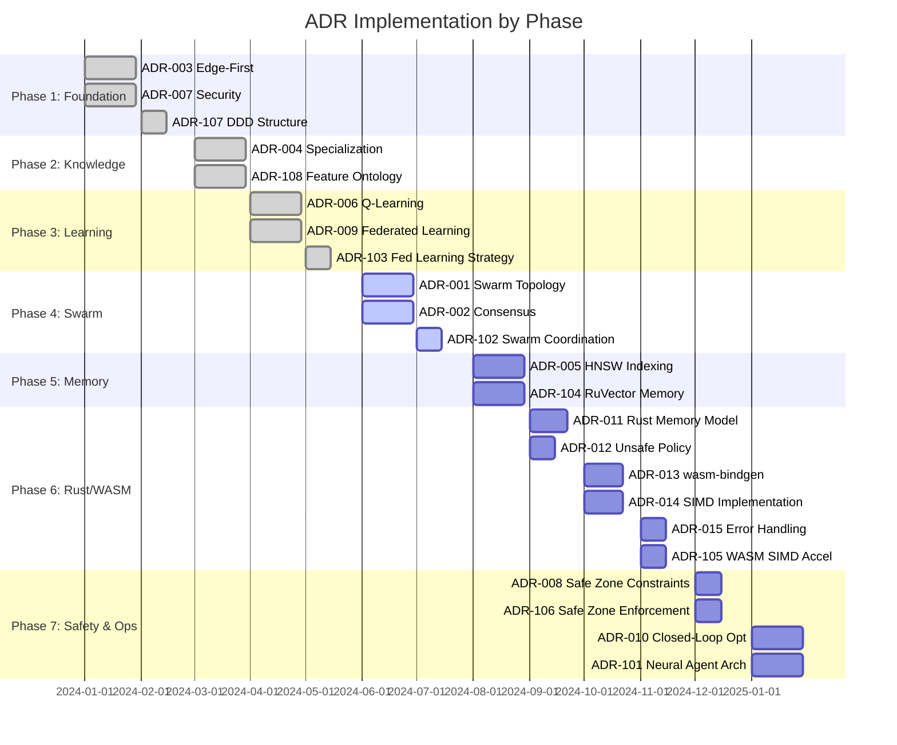
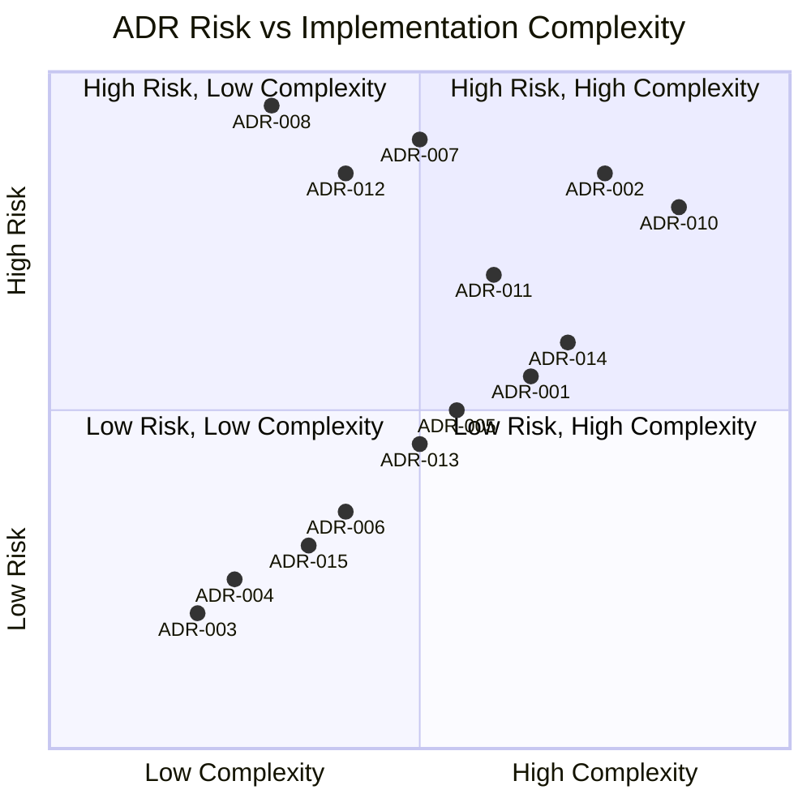
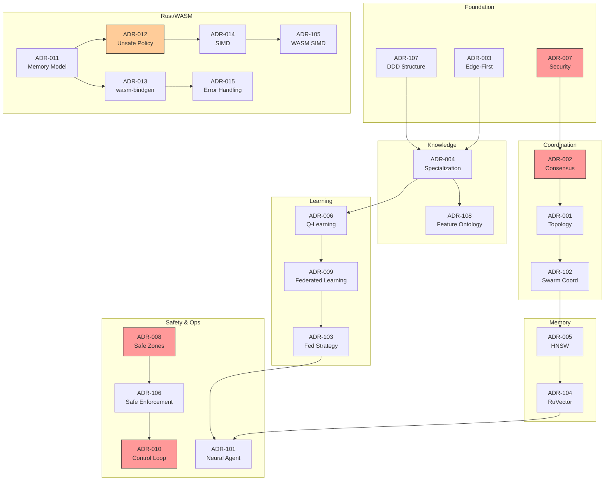

# Technical Decisions Matrix

## Overview

This document provides a cross-reference matrix mapping Architecture Decision Records (ADRs) to Domain-Driven Design bounded contexts, implementation phases, and risk assessments for the ELEX Edge AI Agent Swarm.

---

## ADR Inventory

### Series 001-015: Core Architectural Decisions

| ADR | Title | Status | Category |
|-----|-------|--------|----------|
| [ADR-001](adr/ADR-001-swarm-topology.md) | Swarm Topology Selection | Accepted | Architecture |
| [ADR-002](adr/ADR-002-consensus-protocol.md) | Consensus Protocol Selection | Accepted | Coordination |
| [ADR-003](adr/ADR-003-edge-first-architecture.md) | Edge-First Zero-Cloud Architecture | Accepted | Infrastructure |
| [ADR-004](adr/ADR-004-agent-specialization.md) | One Agent Per Feature Specialization | Accepted | Architecture |
| [ADR-005](adr/ADR-005-vector-memory-hnsw.md) | HNSW Vector Indexing for Semantic Routing | Accepted | Memory |
| [ADR-006](adr/ADR-006-q-learning-engine.md) | Q-Learning Engine for Self-Learning | Accepted | Intelligence |
| [ADR-007](adr/ADR-007-security-cryptography.md) | Security and Cryptography Architecture | Accepted | Security |
| [ADR-008](adr/ADR-008-safe-zone-constraints.md) | Safe Zone Parameter Constraints | Accepted | Safety |
| [ADR-009](adr/ADR-009-federated-learning.md) | Federated Learning for P2P Knowledge Sharing | Accepted | Intelligence |
| [ADR-010](adr/ADR-010-closed-loop-optimization.md) | Closed-Loop Optimization Cycle | Accepted | Operations |
| [ADR-011](adr/ADR-011-rust-memory-model.md) | Rust Memory Model for Agent System | Accepted | Rust/WASM |
| [ADR-012](adr/ADR-012-unsafe-rust-policy.md) | Unsafe Rust Policy | Accepted | Rust/WASM |
| [ADR-013](adr/ADR-013-wasm-bindgen-strategy.md) | wasm-bindgen Strategy for JS Interop | Accepted | Rust/WASM |
| [ADR-014](adr/ADR-014-simd-implementation.md) | SIMD Implementation Strategy | Accepted | Rust/WASM |
| [ADR-015](adr/ADR-015-error-handling.md) | Error Handling Strategy | Accepted | Rust/WASM |

### Series 101-108: Extended Architectural Decisions

| ADR | Title | Status | Category |
|-----|-------|--------|----------|
| [ADR-101](adr/ADR-101-neural-agent-architecture.md) | Neural Agent Architecture for RAN Feature Management | Accepted | Architecture |
| [ADR-102](adr/ADR-102-swarm-coordination-protocol.md) | Hybrid Swarm Coordination Protocol | Accepted | Coordination |
| [ADR-103](adr/ADR-103-federated-learning-strategy.md) | Federated Learning for Distributed Intelligence | Accepted | Intelligence |
| [ADR-104](adr/ADR-104-ruvector-memory-integration.md) | RuVector Memory System Integration | Accepted | Memory |
| [ADR-105](adr/ADR-105-wasm-simd-acceleration.md) | WASM SIMD Acceleration for Edge Deployment | Accepted | Performance |
| [ADR-106](adr/ADR-106-safe-zone-enforcement.md) | Safe Zone Parameter Enforcement | Accepted | Safety |
| [ADR-107](adr/ADR-107-domain-driven-design-structure.md) | Domain-Driven Design for Agent System | Accepted | Architecture |
| [ADR-108](adr/ADR-108-ericsson-feature-ontology.md) | Ericsson RAN Feature Ontology Integration | Accepted | Knowledge |

**Total ADRs: 23**

---

## ADR to Bounded Context Mapping

### Core Domains

| ADR | Knowledge | Intelligence | Optimization |
|-----|:---------:|:------------:|:------------:|
| ADR-001: Swarm Topology | | | X |
| ADR-004: Agent Specialization | X | | |
| ADR-006: Q-Learning Engine | | X | |
| ADR-009: Federated Learning | | X | |
| ADR-010: Closed-Loop Optimization | | | X |
| ADR-101: Neural Agent Architecture | X | X | |
| ADR-103: Federated Learning Strategy | | X | |
| ADR-108: Ericsson Feature Ontology | X | | |

### Supporting Domains

| ADR | Coordination | Memory | Security |
|-----|:------------:|:------:|:--------:|
| ADR-002: Consensus Protocol | X | | |
| ADR-005: HNSW Vector Indexing | | X | |
| ADR-007: Security & Cryptography | | | X |
| ADR-102: Swarm Coordination | X | | |
| ADR-104: RuVector Memory | | X | |

### Rust/WASM Implementation Domain

| ADR | Memory Model | Safety | Performance | Interop |
|-----|:------------:|:------:|:-----------:|:-------:|
| ADR-011: Rust Memory Model | X | X | | |
| ADR-012: Unsafe Rust Policy | | X | X | |
| ADR-013: wasm-bindgen Strategy | | | | X |
| ADR-014: SIMD Implementation | | | X | |
| ADR-015: Error Handling | | X | | X |
| ADR-105: WASM SIMD Acceleration | | | X | |

### Infrastructure & Safety Domains

| ADR | Infrastructure | Safety | Runtime |
|-----|:--------------:|:------:|:-------:|
| ADR-003: Edge-First Architecture | X | | X |
| ADR-008: Safe Zone Constraints | | X | |
| ADR-106: Safe Zone Enforcement | | X | |
| ADR-107: DDD Structure | X | | |

---

## ADR to Implementation Phase Mapping

### Phase Timeline

### Phase-ADR Matrix

| Phase | Focus | ADRs | Primary Deliverables |
|-------|-------|------|---------------------|
| 1 | Foundation | ADR-003, ADR-007, ADR-107 | Edge runtime, security, DDD structure |
| 2 | Knowledge | ADR-004, ADR-108 | Agent specialization, feature ontology |
| 3 | Learning | ADR-006, ADR-009, ADR-103 | Q-learning engine, federated learning |
| 4 | Swarm | ADR-001, ADR-002, ADR-102 | Topology, consensus, coordination |
| 5 | Memory | ADR-005, ADR-104 | HNSW indexing, RuVector integration |
| 6 | Rust/WASM | ADR-011 to ADR-015, ADR-105 | Rust implementation, WASM compilation |
| 7 | Safety & Ops | ADR-008, ADR-010, ADR-101, ADR-106 | Safe zones, optimization loop |

---

## Risk Assessment Matrix

### Risk Categories

| Level | Description | Mitigation Required |
|-------|-------------|---------------------|
| CRITICAL | System failure if not implemented correctly | Mandatory review, extensive testing |
| HIGH | Significant degradation possible | Design review, integration testing |
| MEDIUM | Performance or usability impact | Code review, unit testing |
| LOW | Minor issues, easily recoverable | Standard testing |

### ADR Risk Assessment

### Detailed Risk Table

| ADR | Risk Level | Risk Description | Mitigation Strategy |
|-----|------------|------------------|---------------------|
| ADR-002 | CRITICAL | Consensus failure causes split-brain in distributed swarm | Raft quorum enforcement, partition detection, Byzantine tolerance |
| ADR-007 | CRITICAL | Weak cryptography compromises agent identity and data | Ed25519 signatures, AES-256-GCM encryption, key rotation |
| ADR-008 | CRITICAL | Safe zone violation could damage network infrastructure | Hardcoded limits, no override capability, compile-time verification |
| ADR-010 | CRITICAL | Control loop instability could cause cascading failures | Phase gates, KPI validation, automatic rollback |
| ADR-012 | HIGH | Unsafe Rust code could cause memory corruption | Strict policy, SAFETY comments, extensive testing, MIRI checks |
| ADR-011 | HIGH | Incorrect memory model leads to leaks or corruption in WASM | Tiered ownership, Arc for shared, arena allocation |
| ADR-014 | HIGH | SIMD misuse causes undefined behavior or performance regression | Feature detection, scalar fallback, benchmark validation |
| ADR-001 | HIGH | Incorrect topology impacts message routing efficiency | Topology validation, performance monitoring, fallback modes |
| ADR-005 | MEDIUM | HNSW index degradation over time affects routing | Periodic reindexing, ef parameter tuning, monitoring |
| ADR-013 | MEDIUM | wasm-bindgen overhead impacts JS-Rust boundary performance | Minimize crossings, typed arrays, lazy initialization |
| ADR-006 | LOW | Q-learning convergence issues in edge cases | Standard hyperparameters, experience replay, monitoring |
| ADR-015 | LOW | Error handling overhead in hot paths | Error type hierarchy, no allocations in hot path |
| ADR-004 | LOW | Agent specialization limits cross-feature optimization | Category-level coordinators, shared learning |
| ADR-003 | LOW | Edge-first limits cloud backup capabilities | Optional cloud sync, peer backup |

### Rust-Specific Risk Considerations

| ADR | Rust-Specific Risk | Impact | Mitigation |
|-----|-------------------|--------|------------|
| ADR-011 | Arc reference cycles causing memory leaks | Memory growth over time | Weak references, explicit cleanup, leak detection in tests |
| ADR-012 | Unsafe code introducing UB | Crashes, security vulnerabilities | MIRI, AddressSanitizer, mandatory SAFETY docs |
| ADR-013 | serde overhead at JS boundary | Performance degradation | Zero-copy where possible, typed arrays, avoid frequent crossings |
| ADR-014 | SIMD not available on all platforms | Feature parity issues | Runtime detection, scalar fallback, wasm-feature-detect |
| ADR-015 | Panic unwinding in WASM | Aborts instead of graceful errors | panic=abort, Result everywhere, no unwrap in production |

---

## Dependency Graph

### Critical Path Dependencies

**Legend:** Red = Critical Risk, Orange = High Risk

---

## Quality Attribute Impact

### ADR Impact on Quality Attributes

| ADR | Performance | Security | Reliability | Scalability | Maintainability |
|-----|:-----------:|:--------:|:-----------:|:-----------:|:---------------:|
| ADR-001 Swarm Topology | +1 | 0 | +2 | +2 | 0 |
| ADR-002 Consensus | 0 | +1 | +3 | +2 | 0 |
| ADR-003 Edge-First | +2 | +1 | +1 | 0 | +1 |
| ADR-004 Specialization | +1 | 0 | +1 | +2 | +2 |
| ADR-005 HNSW | +3 | 0 | +1 | +2 | 0 |
| ADR-006 Q-Learning | +1 | 0 | +1 | +1 | +1 |
| ADR-007 Security | -1 | +3 | +1 | 0 | +1 |
| ADR-008 Safe Zones | 0 | +2 | +3 | 0 | +1 |
| ADR-009 Federated | 0 | 0 | +1 | +2 | +1 |
| ADR-010 Closed-Loop | +1 | +1 | +2 | +1 | +2 |
| ADR-011 Rust Memory | +2 | +2 | +2 | +1 | +1 |
| ADR-012 Unsafe Policy | +2 | -1 | 0 | +1 | -1 |
| ADR-013 wasm-bindgen | +1 | 0 | +1 | +1 | +2 |
| ADR-014 SIMD | +3 | 0 | 0 | +1 | 0 |
| ADR-015 Error Handling | 0 | +1 | +2 | 0 | +2 |

**Scale:** -2 (negative impact) to +3 (strong positive impact)

---

## Implementation Priority Matrix

### Priority Scoring

Priority = (Risk Level Weight) + (Dependency Count) + (Quality Impact Sum)

| ADR | Risk Weight | Dependencies | Quality Sum | Priority Score | Recommended Order |
|-----|:-----------:|:------------:|:-----------:|:--------------:|:-----------------:|
| ADR-003 | 2 | 0 | 5 | 7 | 1 |
| ADR-007 | 5 | 0 | 4 | 9 | 2 |
| ADR-107 | 2 | 0 | 4 | 6 | 3 |
| ADR-004 | 2 | 2 | 6 | 10 | 4 |
| ADR-108 | 2 | 1 | 3 | 6 | 5 |
| ADR-006 | 2 | 1 | 4 | 7 | 6 |
| ADR-009 | 2 | 1 | 4 | 7 | 7 |
| ADR-002 | 5 | 1 | 6 | 12 | 8 |
| ADR-001 | 4 | 1 | 5 | 10 | 9 |
| ADR-005 | 3 | 2 | 6 | 11 | 10 |
| ADR-011 | 4 | 0 | 8 | 12 | 11 |
| ADR-012 | 4 | 1 | 1 | 6 | 12 |
| ADR-013 | 3 | 1 | 5 | 9 | 13 |
| ADR-014 | 4 | 1 | 4 | 9 | 14 |
| ADR-015 | 2 | 1 | 5 | 8 | 15 |
| ADR-008 | 5 | 0 | 6 | 11 | 16 |
| ADR-010 | 5 | 2 | 7 | 14 | 17 |

---

## Cost-Benefit Analysis

### Development Cost Estimates

| ADR Category | ADRs | Estimated Effort | Ongoing Maintenance | ROI Timeline |
|--------------|------|:----------------:|:-------------------:|:------------:|
| Foundation | ADR-003, ADR-007, ADR-107 | 3 weeks | Low | Immediate |
| Knowledge | ADR-004, ADR-108 | 3 weeks | Low | 1 month |
| Learning | ADR-006, ADR-009, ADR-103 | 4 weeks | Medium | 3 months |
| Swarm Coordination | ADR-001, ADR-002, ADR-102 | 4 weeks | Medium | 2 months |
| Memory | ADR-005, ADR-104 | 3 weeks | Low | 2 months |
| Rust/WASM | ADR-011 to ADR-015, ADR-105 | 5 weeks | Medium | 2 months |
| Safety & Ops | ADR-008, ADR-010, ADR-101, ADR-106 | 4 weeks | High | Immediate |

### Total Project Metrics

| Metric | Value |
|--------|-------|
| Total ADRs | 23 |
| Critical Risk ADRs | 4 (ADR-002, ADR-007, ADR-008, ADR-010) |
| High Risk ADRs | 4 (ADR-001, ADR-011, ADR-012, ADR-014) |
| Rust-Specific ADRs | 6 (ADR-011 to ADR-015, ADR-105) |
| Total Development Effort | 26 weeks |
| Feature Agents | 593 |
| Parameters Covered | 9,432 |
| Counters Covered | 3,368 |
| KPIs Tracked | 199 |

---

## Cross-References

- **ADR Index:** [adr/README.md](./adr/README.md)
- **DDD Context Map:** [ddd/README.md](./ddd/README.md)
- **Architecture:** [architecture.md](./architecture.md)
